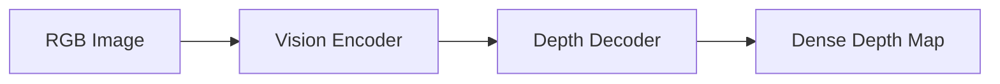

# 🌄 Depth Anything V2

> **Depth Anything V2 is a state-of-the-art monocular depth estimation (MDE) model that generates dense depth maps from a single RGB image.**

---

## 🎯 Purpose

- Monocular Depth Estimation
- Depth Map Generation
- Distance Estimation
- Obstacle Perception

---

## ⭐ Why Depth Anything V2?

| Feature | Description |
|---------|-------------|
| **Single Camera** | Estimates depth using only one RGB camera |
| **Dense Depth Maps** | Predicts depth for every pixel |
| **Edge Preservation** | Maintains sharp object boundaries |
| **Zero-Shot Generalization** | Works across diverse environments without retraining |
| **Lightweight Variants** | Suitable for edge devices and onboard computers |

---

## 🔄 Depth Anything V2 Pipeline



---

## 🧠 How It Works

The model estimates depth from visual cues such as:

- Perspective
- Object Size
- Texture
- Shadows
- Scene Geometry

Unlike stereo vision or LiDAR, it requires only a **single RGB image**.

---

## 📊 Output

| Output | Description |
|---------|-------------|
| **Relative Depth** | Indicates which objects are nearer or farther |
| **Metric Depth*** | Estimates actual distance (e.g., meters) after camera calibration |

> 📌 *Metric depth requires camera calibration or additional depth reference.*

---

## 🚀 Key Features

- Dense pixel-wise depth estimation
- Sharp edge preservation
- Real-time inference
- Zero-shot generalization
- Lightweight deployment for embedded systems

---

## 🚁 Depth Anything V2 in Drones

Common applications include:

- Obstacle Avoidance
- Autonomous Navigation
- Terrain Mapping
- GPS-Denied Navigation
- 3D Scene Understanding

---

## 🏗️ Training Architecture

```text
Teacher Model
      │
      ▼
Generate Pseudo Labels
      │
      ▼
Student Model
      │
      ▼
Depth Anything V2
```

| Component | Purpose |
|----------|---------|
| **Teacher Model** | Generates high-quality pseudo labels |
| **Student Model** | Learns efficient real-world depth estimation |

---

## 📌 Key Points

- Depth Anything V2 is a **monocular depth estimation model**.
- Generates **dense depth maps** from a **single RGB image**.
- Supports **relative** and **metric** depth estimation.
- Eliminates the need for **stereo cameras** or **LiDAR**.
- Optimized for **real-time deployment** on edge devices.
