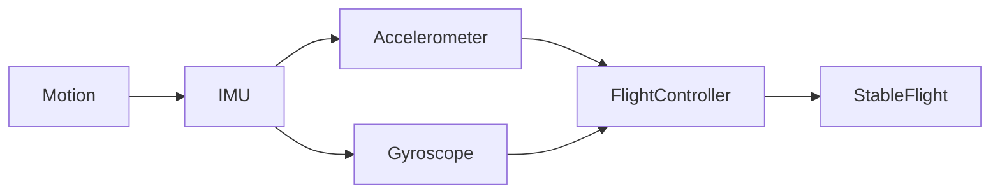

# 📦 IMU (Inertial Measurement Unit)

> **The IMU measures how a drone moves by sensing acceleration and rotation.**

---

## 🎯 At a Glance

| Feature | Description |
|---------|-------------|
| **Full Form** | Inertial Measurement Unit |
| **Purpose** | Measures motion of the drone |
| **Measures** | Linear Acceleration + Angular Velocity |
| **Does NOT Measure** | Position or Location |
| **Used For** | Flight stabilization, Dead Reckoning, Navigation |

---

## 💡 Think of it as...

> **The IMU is the drone's "sense of motion."**  
> It tells the flight controller **how the drone is moving**, not **where it is**.

---

## 🧠 Key Idea

Unlike **GPS**, which tells the drone **where it is**, the **IMU** tells the drone:

- How fast it is accelerating
- How fast it is rotating
- How its orientation is changing

This makes the IMU the primary sensor for:

- 🎯 Real-time stabilization
- 🛰️ Dead Reckoning
- 🤖 Flight control

---

## 🔄 How an IMU Works

---

# 🧩 Core Components

A standard drone IMU consists of two **MEMS (Micro-Electro-Mechanical Systems)** sensors.

| Sensor | Measures | Unit |
|---------|----------|------|
| **3-Axis Accelerometer** | Linear Acceleration | m/s² |
| **3-Axis Gyroscope** | Angular Velocity | °/s or rad/s |

---

## 📍 3-Axis Accelerometer

### Purpose

Measures **linear acceleration** along the three axes.

| Axis | Direction |
|------|-----------|
| X | Left ↔ Right |
| Y | Forward ↔ Backward |
| Z | Up ↕ Down |

### Output

- **Unit:** m/s²
- Detects acceleration caused by motion and gravity.

### Important Note

Even when the drone is **stationary**, the accelerometer measures Earth's gravity.

> 🌍 Gravity ≈ **9.81 m/s² (1g)**

---

## 🔄 3-Axis Gyroscope

### Purpose

Measures **angular velocity** (how fast the drone rotates).

| Axis | Rotation |
|------|-----------|
| X | Roll |
| Y | Pitch |
| Z | Yaw |

### Output

- Degrees per second (°/s)
- Radians per second (rad/s)

---

## 📊 Sensor Comparison

| Accelerometer | Gyroscope |
|--------------|-----------|
| Measures acceleration | Measures rotation |
| Unit: m/s² | Unit: °/s or rad/s |
| Detects gravity | Cannot detect gravity |
| Good for tilt estimation | Good for fast motion |

---

# 🛰️ 9-DOF IMU

Many modern drones use a **9-DOF (Degrees of Freedom)** IMU.

| Component | Axes |
|-----------|------|
| Accelerometer | 3 |
| Gyroscope | 3 |
| Magnetometer | 3 |

Total:

**3 + 3 + 3 = 9 Degrees of Freedom**

---

## 🧭 Magnetometer

### Purpose

Measures Earth's magnetic field.

Used as a:

- 🧭 Digital Compass
- Heading Reference
- Yaw Correction

---

## 📦 IMU Variants

| Type | Components |
|------|------------|
| **6-DOF IMU** | Accelerometer + Gyroscope |
| **9-DOF IMU** | Accelerometer + Gyroscope + Magnetometer |

---

# 🎯 Applications

- 🚁 Drone Flight Stabilization
- 🤖 Robot Navigation
- 🚗 Autonomous Vehicles
- 📱 Smartphones
- 🎮 VR/AR Motion Tracking
- 🚀 Aerospace Systems

---

# ⚠️ Remember

> 📌 **IMU tells HOW the drone moves.**

> 📌 **GPS tells WHERE the drone is.**

> 📌 **Accelerometer measures acceleration.**

> 📌 **Gyroscope measures rotation.**

> 📌 **Magnetometer provides heading (compass).**

---

# 🚀 Quick Revision

| Question | Answer |
|----------|--------|
| What is an IMU? | Motion sensing unit |
| Main Sensors? | Accelerometer + Gyroscope |
| Optional Sensor? | Magnetometer |
| Accelerometer Measures? | Linear Acceleration |
| Gyroscope Measures? | Angular Velocity |
| Magnetometer Measures? | Earth's Magnetic Field |
| Used For? | Stabilization & Navigation |
| Does it know location? | ❌ No (GPS does) |
