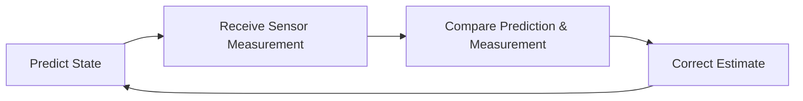

# 🧠 Kalman Filter

> **A Kalman Filter is an algorithm that estimates the true state of a system by combining noisy sensor measurements with predictions.**

---

## 🎯 Purpose

- Estimate system parameters accurately
- Reduce the effect of sensor noise
- Continuously improve estimates in real time

---

## 🔄 Working Principle

The Kalman Filter follows a continuous loop:

---

## 📊 Input & Output

| Input | Output |
|-------|--------|
| Noisy sensor measurements | Accurate state estimate |
| Previous system state | Updated system state |

---

## 📍 Common Estimations

| Measurement Available | Estimated Parameter |
|-----------------------|---------------------|
| Object Position | Position & Velocity |
| Pressure Sensor | Object Weight |
| IMU Data | Position, Velocity & Acceleration |

---

## 🚁 Kalman Filter in Drones

The Kalman Filter combines data from multiple sensors:

- **IMU** → Acceleration & Angular Velocity
- **GPS** → Position
- **Barometer** → Altitude
- **Magnetometer** → Heading

These measurements are fused to estimate:

- Position
- Velocity
- Orientation

---

## 📌 Key Point

> The Kalman Filter is **not just a smoothing algorithm**. Its primary purpose is to estimate system states that cannot be measured accurately or directly by combining predictions with noisy sensor data.
