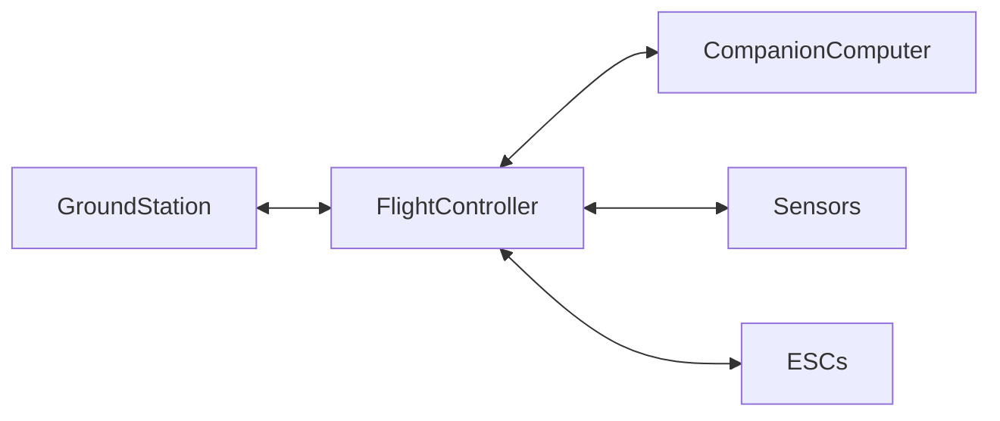

# 📡 MAVLink (Micro Air Vehicle Link)

> **MAVLink is a lightweight, open-source communication protocol used for exchanging data between drones, flight controllers, ground control stations, and companion computers.**

---

## 🎯 Purpose

- Send commands to the drone
- Receive telemetry from the drone
- Configure flight parameters
- Enable real-time communication between drone components

---

## 🏷️ Why is it called the "HTML of Drones"?

Just as **HTML standardizes communication between web browsers and websites**, MAVLink standardizes communication between different drone hardware and software.

This allows components from different manufacturers to work together seamlessly.

---

## ⭐ Key Features

| Feature | Description |
|---------|-------------|
| **Lightweight** | Optimized for low-bandwidth communication and embedded systems |
| **Bidirectional** | Supports sending commands and receiving telemetry simultaneously |
| **Interoperable** | Enables communication between different flight controllers and ground stations |
| **Customizable** | Supports custom message definitions using XML dialects |

---

## 🔄 Communication Flow

---

## 📦 How MAVLink Works

MAVLink exchanges information using **binary messages (packets)**.

Each packet contains:

| Packet Component | Purpose |
|------------------|---------|
| **Header** | Sender, receiver and packet information |
| **Message ID** | Identifies the message type |
| **Payload** | Actual data being transmitted |
| **Checksum** | Detects transmission errors |

> 📌 The **Message ID** determines the meaning of the packet.

---

## 📍 Example

| Message ID | Purpose |
|------------|---------|
| **0** | Heartbeat (system alive) |

---

## 🔧 MAVLink Dialects

MAVLink message definitions are stored in **XML dialect files**.

These dialects can be:

- Standard MAVLink messages
- PX4-specific messages
- ArduPilot-specific messages
- Custom project-specific messages

---

## 🛰️ Common MAVLink Communication

| Sender | Receiver | Data |
|---------|----------|------|
| Ground Station | Flight Controller | Commands, Mission Upload |
| Flight Controller | Ground Station | GPS, Battery, Attitude, Telemetry |
| Companion Computer | Flight Controller | Vision Data, Navigation Commands |
| Flight Controller | Companion Computer | Vehicle State, Sensor Data |

---

## 🖥️ Popular MAVLink Software

- **QGroundControl**
- **Mission Planner**
- **MAVProxy**
- **MAVSDK**
- **DroneKit**

---

## 📌 Key Points

- MAVLink is a **communication protocol**, not a flight controller.
- It uses **binary packets** for efficient communication.
- Supports **real-time, bidirectional communication**.
- Works with flight controllers like **PX4** and **ArduPilot**.
- Enables interoperability between different drone hardware and software.
