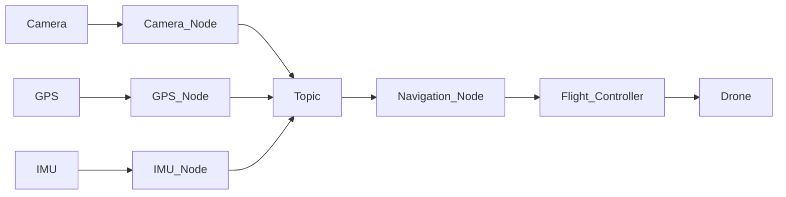

# 🤖 ROS & ROS 2 (Robot Operating System)

> **ROS (Robot Operating System)** is an open-source **robotics middleware** that provides a standard framework for communication, hardware control, sensing, navigation, and autonomous robot development.

> **ROS 2** is the next-generation ROS built for **real-time performance, distributed systems, security, and industrial robotics**.

---

# 📌 Overview

| Property | ROS | ROS 2 |
|----------|------|--------|
| Released | 2007 | 2017 |
| Communication | TCPROS | DDS |
| Real-Time | ❌ | ✅ |
| Security | ❌ | ✅ |
| Multi-Robot | Limited | Native |
| Best For | Research | Industry & Production |

---

# 💡 Why ROS?

Instead of writing everything from scratch, ROS provides ready-made tools for:

- Hardware Communication
- Sensor Integration
- Navigation
- Computer Vision
- Motion Planning
- Simulation
- Robot Communication

---

# 🏗️ How ROS Works

Every functionality is divided into **Nodes**.

Each node performs **one specific task** and communicates with other nodes.



---

# 🧩 Core Components

| Component | Purpose |
|-----------|---------|
| **Node** | Individual program |
| **Topic** | Shares data between nodes |
| **Publisher** | Sends messages |
| **Subscriber** | Receives messages |
| **Service** | Request–Response communication |
| **Action** | Long-running task with feedback |
| **Package** | Collection of ROS files |
| **Workspace** | Development environment |

---

# 📡 Communication Types

| Type | Purpose | Example |
|------|----------|---------|
| **Topic** | Continuous Data | Camera, IMU, GPS |
| **Service** | Instant Request | Get Battery Level |
| **Action** | Long Tasks | Navigate to Waypoint |

---

# ⚙️ ROS Workflow

```mermaid
flowchart LR

Sensors
--> ROS Nodes

ROS Nodes
--> Topics

Topics
--> Processing Nodes

Processing Nodes
--> Controller

Controller
--> Motors
```

---

# 🚁 ROS in a Drone

Example:

| Node | Function |
|------|----------|
| Camera Node | Publishes images |
| IMU Node | Publishes orientation |
| GPS Node | Publishes location |
| Object Detection Node | Detects obstacles |
| Path Planning Node | Generates path |
| Flight Controller Node | Controls motors |

---

# 📍 Example Data Flow

```text
Camera
   │
   ▼
Camera Node
   │
Publishes Image
   │
   ▼
Object Detection Node
   │
Detects Person
   │
Publishes Coordinates
   │
   ▼
Navigation Node
   │
Plans Safe Path
   │
   ▼
Flight Controller
   │
Controls Drone
```

---

# 🚀 Why ROS 2?

ROS 2 improves ROS by adding:

- Real-Time Communication
- DDS Middleware
- Better Reliability
- Security
- Multi-Robot Support
- Cross-Platform Support (Linux, Windows, macOS)

---

# 🔄 ROS vs ROS 2

| Feature | ROS | ROS 2 |
|---------|-----|--------|
| Middleware | TCPROS | DDS |
| Real-Time | ❌ | ✅ |
| Security | ❌ | ✅ |
| QoS | ❌ | ✅ |
| Multi-Robot | Limited | Native |
| Production Ready | ❌ | ✅ |

---

# 🛰️ ROS in UAV Applications

- Autonomous Flight
- SLAM
- Object Detection
- Object Tracking
- Obstacle Avoidance
- Path Planning
- Sensor Fusion
- Drone Swarms
- MAVLink Communication
- PX4 / ArduPilot Integration

---

# 🛠️ Common ROS Tools

| Tool | Purpose |
|------|---------|
| **RViz** | 3D Visualization |
| **Gazebo** | Robot Simulation |
| **MAVROS** | ROS ↔ MAVLink Bridge |
| **MoveIt** | Motion Planning |
| **rosbag** | Record & Replay Data |

---

# 🔑 Keywords

| Keyword | Meaning |
|----------|---------|
| **Node** | Independent program |
| **Topic** | Data communication channel |
| **Publisher** | Sends messages |
| **Subscriber** | Receives messages |
| **DDS** | Communication middleware (ROS 2) |
| **QoS** | Communication reliability settings |
| **MAVROS** | Connects ROS with PX4/ArduPilot |
| **RViz** | Visualization software |
| **Gazebo** | Robot simulator |

---

# 📚 References

- ROS: https://www.ros.org/
- ROS Documentation: https://docs.ros.org/
- ROS 2 Documentation: https://docs.ros.org/en/rolling/
- MAVROS: https://github.com/mavlink/mavros
- PX4 ROS: https://docs.px4.io/main/en/ros/

---

# 🚀 Quick Revision

```text
ROS
│
├── Middleware
├── Nodes
├── Topics
├── Services
├── Actions
│
├── Used For
│    ├── Sensors
│    ├── Navigation
│    ├── Vision
│    ├── SLAM
│    └── Control
│
└── ROS 2
     ├── DDS
     ├── QoS
     ├── Security
     ├── Real-Time
     └── Multi-Robot
```
