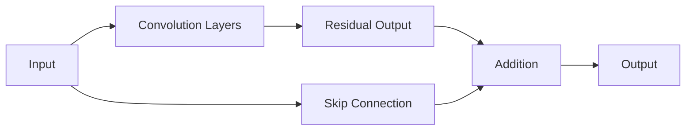

# 🧠 ResNet (Residual Network)

> **ResNet (Residual Network) is a deep convolutional neural network (CNN) that uses residual learning to train very deep models efficiently.**

---

## 🎯 Purpose

- Image Classification
- Object Detection
- Feature Extraction
- Object Tracking

---

## 🔄 How ResNet Works

Instead of learning the entire output, ResNet learns the **residual (difference)** between the input and the desired output.

It achieves this using **Residual Blocks** and **Skip Connections**.

---

## 🧩 Key Components

| Component | Purpose |
|----------|---------|
| **Residual Block** | Learns the residual (difference) |
| **Skip Connection** | Bypasses layers and passes the input directly |
| **Residual Learning** | Simplifies training of deep networks |

---

## ⭐ Why Skip Connections?

Skip connections help overcome the **Vanishing Gradient Problem**, allowing gradients to flow through deep networks during training.

This enables training of very deep models such as:

- ResNet-18
- ResNet-34
- ResNet-50
- ResNet-101
- ResNet-152

---

## 🚁 ResNet in Drones

Common applications include:

- Object Detection
- Obstacle Detection & Avoidance
- Drone vs Bird Classification
- Aerial Surveillance
- Precision Agriculture
- Feature Extraction for Vision Models

---

## 📌 Key Points

- ResNet is a **CNN architecture**.
- Uses **Residual Blocks** and **Skip Connections**.
- Solves the **Vanishing Gradient Problem**.
- Enables training of **very deep neural networks**.
- Widely used as a **backbone** in modern computer vision models.
