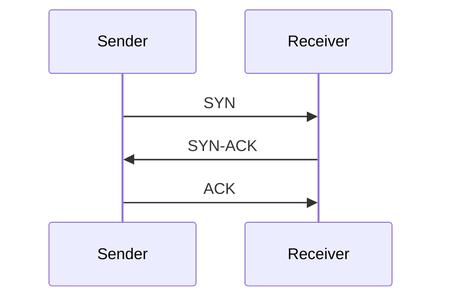

# 🌐 TCP vs UDP

> **TCP and UDP are the two primary transport layer protocols used for data communication over a network.**

---

## 🎯 Purpose

| Protocol | Priority |
|----------|----------|
| **TCP (Transmission Control Protocol)** | Reliability |
| **UDP (User Datagram Protocol)** | Speed |

---

## ⚖️ TCP vs UDP

| Feature | TCP | UDP |
|---------|-----|-----|
| Connection Type | Connection-Oriented | Connectionless |
| Reliability | ✅ Guaranteed | ❌ Not Guaranteed |
| Packet Ordering | ✅ Maintained | ❌ Not Maintained |
| Error Checking | ✅ Yes | Basic Checksum Only |
| Retransmission | ✅ Yes | ❌ No |
| Speed | Slower | Faster |
| Header Size | 20–60 Bytes | 8 Bytes |

---

# 🔗 TCP (Transmission Control Protocol)

> **A reliable, connection-oriented protocol that ensures data is delivered completely and in the correct order.**

---

## 📌 How TCP Works

Before sending data, TCP establishes a connection using the **Three-Way Handshake**.



After the connection is established, data transmission begins.

---

## ⭐ Key Features

- Connection-oriented
- Reliable data delivery
- Packet acknowledgment
- Automatic retransmission of lost packets
- Maintains packet order

---

## 📍 Common Use Cases

- HTTP / HTTPS
- Email (SMTP)
- File Transfer (FTP)
- Online Banking
- Cloud Storage

---

# ⚡ UDP (User Datagram Protocol)

> **A fast, connectionless protocol that sends data without guaranteeing delivery or order.**

---

## 📌 How UDP Works

UDP sends packets directly without establishing a connection.

```text
Sender
   │
   ├── Packet 1 ─────────►
   ├── Packet 2 ─────────►
   ├── Packet 3 ─────────►
   │
Receiver
```

No acknowledgments or retransmissions are performed.

---

## ⭐ Key Features

- Connectionless
- Very low latency
- No acknowledgments
- No retransmissions
- Lower communication overhead

---

## 📍 Common Use Cases

- Live Video Streaming
- Voice over IP (VoIP)
- Online Gaming
- Video Conferencing
- Telemetry & Sensor Data

---

# 🚁 TCP vs UDP in Drones

| Communication | Protocol |
|---------------|----------|
| Mission Upload | TCP |
| Firmware Update | TCP |
| File Transfer | TCP |
| Live Video Stream | UDP |
| Telemetry | UDP (commonly used) |
| Sensor Data | UDP |

---

## 📌 Key Points

- **TCP** → Reliable, ordered, but slower.
- **UDP** → Fast, lightweight, but unreliable.
- Choose **TCP** when every packet matters.
- Choose **UDP** when low latency is more important than guaranteed delivery.
