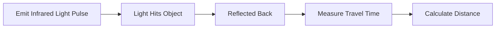

# 📡 Time-of-Flight (ToF)

> **A Time-of-Flight (ToF) sensor measures distance by calculating the time taken for a light pulse to travel to an object and back.**

---

## 🎯 Purpose

- Measure object distance
- Generate depth information
- Enable obstacle detection
- Maintain stable altitude

---

## 🔄 How ToF Works

---

## 📐 Distance Formula

\[
d = \frac{c \times t}{2}
\]

Where:

| Symbol | Meaning |
|--------|---------|
| **d** | Distance to the object |
| **c** | Speed of light |
| **t** | Round-trip travel time of the light pulse |

> 📌 The distance is divided by **2** because the light travels **to the object and back**.

---

## 📊 Key Features

| Feature | Description |
|---------|-------------|
| **Working Principle** | Measures light travel time |
| **Light Source** | Infrared (IR) Laser / LED |
| **Accuracy** | Millimeter to centimeter level |
| **Output** | Distance / Depth Information |

---

## 🚁 ToF in Drones

Common applications include:

- Obstacle Avoidance
- Stable Hovering
- Altitude Holding
- Autonomous Navigation
- 3D Environment Mapping

---

## 📌 Key Points

- ToF uses **infrared light** to measure distance.
- Distance is calculated from the **time taken by light to return**.
- Provides **high-accuracy depth measurements**.
- Widely used for **obstacle sensing** and **precision altitude control**.
