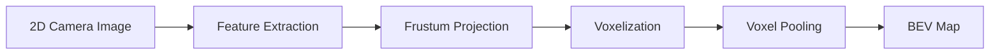

# 🧊 Voxel Pooling

> **Voxel Pooling is a 3D perception technique that converts 2D image features into a 3D voxel grid for spatial understanding.**

---

## 🎯 Purpose

- Convert **2D → 3D** scene representation
- Generate **Bird's-Eye View (BEV)**
- Improve environmental perception

---

## 🔄 Workflow

---

## 🧩 Key Steps

| Step | Description |
|------|-------------|
| **Frustum Projection** | Projects 2D image features into 3D space |
| **Voxelization** | Divides the 3D space into voxels (3D pixels) |
| **Voxel Pooling** | Aggregates features into each voxel |
| **BEV Generation** | Converts the voxel grid into a top-down map |

---

## 🚁 Applications in Drones

- Obstacle Avoidance
- 3D Object Detection
- Path Planning
- Multi-Sensor Fusion (Camera + LiDAR + Radar)

---

## 📌 Key Points

- **Voxel = 3D Pixel**
- Converts **2D camera images into a 3D representation**
- Generates a **Bird's-Eye View (BEV)** for navigation
- Helps drones understand the environment for autonomous flight
