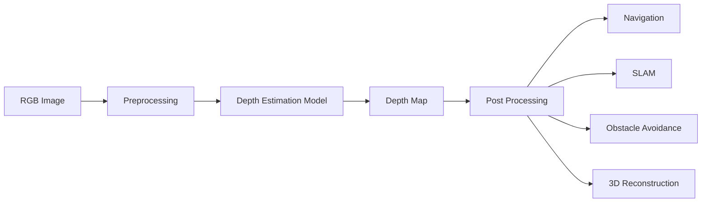
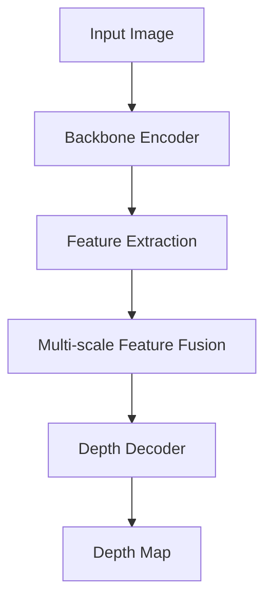

# 🌍 Depth Estimation Models

> A comprehensive guide to modern deep learning models for monocular, video, and stereo depth estimation.


---

# 📖 Table of Contents

- Introduction
- What is Depth Estimation?
- Why is Depth Estimation Important?
- Types of Depth Estimation
- Applications
- Workflow
- Key Challenges
- Official Resources

---

# 📚 Introduction

Depth estimation is one of the core perception tasks in computer vision. It enables machines to estimate the distance between the camera and every visible point in a scene, allowing them to understand the three-dimensional structure of the environment.

Unlike object detection or image classification, which identify **what** is present in an image, depth estimation answers **how far** each object is from the camera.

The output is a **Depth Map**, where every pixel represents an estimated depth value.

Depth estimation plays a crucial role in:

- 🤖 Robotics
- 🚗 Autonomous Driving
- 🚁 UAVs & FPV Drones
- 🛰 SLAM
- 🥽 Augmented & Virtual Reality
- 🏗 3D Reconstruction
- 🏭 Industrial Automation

---

# 🖼 What is Depth Estimation?

Depth estimation predicts the distance between the camera and every pixel in an image.

The output is called a **Depth Map**.

```
RGB Image
        │
        ▼
Depth Estimation Model
        │
        ▼
Depth Map
```

Typical visualization:

```
White  → Near Objects

Gray   → Medium Distance

Black  → Far Objects
```

---

# ❓ Why is Depth Estimation Important?

Traditional computer vision answers:

> "What is this object?"

Depth estimation additionally answers:

> "How far away is this object?"

This enables autonomous systems to understand:

- Scene geometry
- Free navigable space
- Relative object positions
- Obstacle distance
- Safe navigation paths

Without depth information, robots and autonomous vehicles cannot accurately estimate distances or avoid collisions.

---

# 🧠 Types of Depth Estimation

## 1️⃣ Monocular Depth Estimation

Uses **one RGB camera**.

```
RGB Image
      │
      ▼
 Neural Network
      │
      ▼
 Relative / Metric Depth
```

### Advantages

- Low hardware cost
- Easy deployment
- Lightweight
- Suitable for embedded systems

### Limitations

- Scale ambiguity
- Harder to estimate absolute distances

Popular models:

- Depth Anything V2
- MiDaS
- Depth Pro
- Marigold

---

## 2️⃣ Stereo Depth Estimation

Uses **two synchronized cameras**.

```
Left Camera
       \
        \
         ▼
 Stereo Matching
         │
         ▼
 Metric Depth
```

### Advantages

- True metric depth
- Excellent geometric accuracy
- Ideal for robotics

### Limitations

- Camera calibration required
- Higher computational cost

Popular model:

- FoundationStereo

---

## 3️⃣ Video Depth Estimation

Processes a sequence of video frames.

```
Frame Sequence
       │
       ▼
Temporal Network
       │
       ▼
Consistent Depth Maps
```

### Advantages

- Temporal consistency
- Reduced flickering
- Stable predictions

Popular model:

- DepthCrafter

---

# 🌍 Applications

| Domain | Applications |
|---------|--------------|
| 🤖 Robotics | Navigation, Manipulation |
| 🚗 Autonomous Driving | Obstacle Avoidance |
| 🚁 FPV Drones | Terrain Following |
| 🛰 SLAM | Localization & Mapping |
| 🏗 3D Reconstruction | Digital Twins |
| 🥽 AR / VR | Scene Understanding |
| 🏭 Industrial Automation | Inspection Robots |
| 🌾 Agriculture | Crop Monitoring |
| 🏥 Healthcare | Surgical Navigation |

---

# 🔄 General Workflow



---

# 🏗 High-Level Architecture



---

# ⚠ Key Challenges

Real-world depth estimation remains challenging due to:

- Dynamic scenes
- Motion blur
- Reflective surfaces
- Transparent objects
- Thin structures
- Textureless regions
- Lighting variations
- Scale ambiguity
- Occlusions

Modern foundation models address these challenges using large-scale training datasets, Vision Transformers (ViTs), diffusion models, and multi-scale feature fusion.

---

# 📂 Official Resources

The following links provide the official papers, repositories, demos, and project pages for the models covered in this documentation.

| Model | Official Repository | Project Page | Paper |
|--------|---------------------|--------------|-------|
| Depth Anything V2 | https://github.com/DepthAnything/Depth-Anything-V2 | https://depth-anything-v2.github.io | https://arxiv.org/abs/2406.09414 |
| MiDaS | https://github.com/isl-org/MiDaS | — | https://arxiv.org/abs/1907.01341 |
| DepthCrafter | https://github.com/Tencent/DepthCrafter *(or official repository if updated)* | See project page | Official paper |
| Depth Pro | https://github.com/apple/ml-depth-pro | https://apple.github.io/ml-depth-pro/ | Official paper |
| Marigold | https://github.com/prs-eth/Marigold | https://marigoldmonodepth.github.io/ | Official paper |
| FoundationStereo | Official GitHub repository | Official project page | Official paper |

---

# 📌 Notes

Instead of embedding remote images (which often break over time), this documentation references the official repositories and project pages maintained by the model authors. In the following sections, architecture figures, qualitative results, and benchmark images can be downloaded from those official sources and stored locally in your repository (e.g., `images/depth-anything-v2/architecture.png`) for stable rendering.

---

# ➡ Next

Part 2 covers:

- Evaluation Metrics
- Benchmark Datasets
- Relative vs Metric Depth
- Accuracy Metrics
- Inference Speed
- Model Evaluation Criteria
