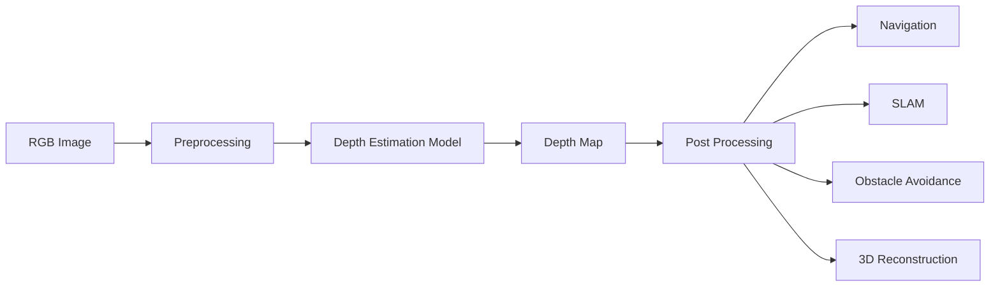
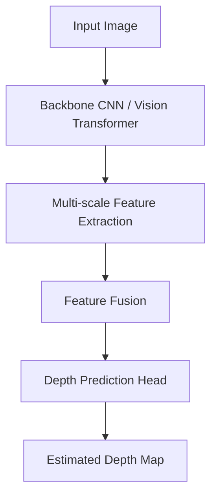

# 🌍 Depth Estimation Models

> A comprehensive guide to modern deep learning models for monocular, video, and stereo depth estimation.


---

# 📖 Table of Contents

- [Introduction](#-introduction)
- [What is Depth Estimation?](#-what-is-depth-estimation)
- [Why is Depth Estimation Important?](#-why-is-depth-estimation-important)
- [Types of Depth Estimation](#-types-of-depth-estimation)
- [Applications](#-applications)
- [General Workflow](#-general-workflow)
- [Challenges](#-key-challenges)
- [Next Section](#-next-section)

---

# 📚 Introduction

Depth estimation is one of the fundamental perception tasks in computer vision that enables machines to understand the **three-dimensional structure** of a scene from one or more images.

Unlike traditional image recognition, which identifies **what** is present in an image, depth estimation determines **how far** every object is from the camera. The result is represented as a **depth map**, where each pixel stores an estimated distance value.

This capability is essential for systems that must safely interact with their surroundings, including autonomous vehicles, mobile robots, drones, augmented reality devices, and industrial automation systems.

---

# 🖼 What is Depth Estimation?

Depth estimation is the process of predicting the distance between the camera and every visible point in an image.

The output is known as a **depth map**.

- **Bright pixels** → Closer objects
- **Dark pixels** → Farther objects

## Example

| RGB Image | Estimated Depth Map |
|-----------|---------------------|
|  |  |

**Image Source:** MiDaS Official Repository

---

# ❓ Why is Depth Estimation Important?

Traditional computer vision answers:

> **"What is this object?"**

Depth estimation additionally answers:

> **"How far away is this object?"**

This additional information enables machines to understand:

- Object distance
- Scene geometry
- Navigable free space
- Obstacle locations
- Relative object positions
- Environmental structure

Without depth information, autonomous systems cannot accurately estimate collision risks or navigate complex environments.

---

# 🧠 Types of Depth Estimation

Modern deep learning methods can be divided into three categories.

## 1️⃣ Monocular Depth Estimation

Uses a **single RGB camera**.

```text
RGB Image
     │
     ▼
 Feature Extractor
     │
     ▼
 Deep Neural Network
     │
     ▼
 Relative / Metric Depth Map
```

### Advantages

- Only one camera required
- Low hardware cost
- Easy deployment
- Suitable for embedded systems

### Limitations

- Scale ambiguity
- Absolute distance is difficult to estimate
- Performance depends heavily on training data

### Popular Models

- Depth Anything V2
- MiDaS
- Depth Pro
- Marigold

---

## 2️⃣ Stereo Depth Estimation

Uses **two synchronized cameras** separated by a fixed baseline.

```text
Left Image      Right Image
      \          /
       \        /
        ▼      ▼
     Stereo Matching
             │
             ▼
        Disparity Map
             │
             ▼
        Metric Depth
```

### Advantages

- True metric depth
- High geometric accuracy
- Excellent for robotics

### Limitations

- Requires camera calibration
- Higher computational cost
- Increased hardware complexity

### Popular Model

- FoundationStereo

---

## 3️⃣ Video Depth Estimation

Processes a sequence of video frames instead of a single image.

```text
Frame 1
Frame 2
Frame 3
Frame 4
    │
    ▼
 Temporal Feature Learning
    │
    ▼
 Consistent Depth Maps
```

### Advantages

- Smooth predictions
- Reduced flickering
- Motion-aware depth estimation

### Limitations

- More computationally intensive
- Requires temporal modeling

### Popular Model

- DepthCrafter

---

# 🌍 Applications

Depth estimation is widely used in modern AI and robotics.

| Domain | Example Applications |
|---------|---------------------|
| 🚗 Autonomous Driving | Obstacle avoidance, lane understanding |
| 🤖 Robotics | Navigation, manipulation |
| 🚁 FPV Drones | Terrain following, autonomous flight |
| 🛰 SLAM | Localization and mapping |
| 🏗 3D Reconstruction | Digital twins, photogrammetry |
| 🥽 Augmented Reality | Scene understanding |
| 🏭 Industrial Automation | Robot inspection |
| 🌾 Agriculture | Crop monitoring |
| 🏥 Healthcare | Surgical navigation |
| 📷 Smart Surveillance | Human localization |

---

# 🔄 General Workflow



---

# 🏗 High-Level Network Architecture



---

# ⚠ Key Challenges

Depth estimation remains an active research area due to several difficult real-world conditions.

- Dynamic scenes
- Transparent objects
- Reflective surfaces
- Thin structures
- Motion blur
- Occlusions
- Poor lighting
- Scale ambiguity
- Weather effects
- Textureless regions

Different models use different architectures and training strategies to overcome these challenges.

---

# 📌 Summary

| Category | Examples |
|-----------|----------|
| Monocular | Depth Anything V2, MiDaS, Depth Pro, Marigold |
| Video | DepthCrafter |
| Stereo | FoundationStereo |

Each model is optimized for different applications depending on speed, accuracy, hardware availability, and deployment requirements.

---

# ➡ Next Section

The next part covers:

- Evaluation Metrics
- Benchmark Datasets
- Accuracy Measures
- Speed Metrics
- Relative vs Metric Depth
- Benchmark Comparison Tables

Following that, each model will be explained in detail, including its architecture, strengths, weaknesses, benchmarks, and recommended use cases.
