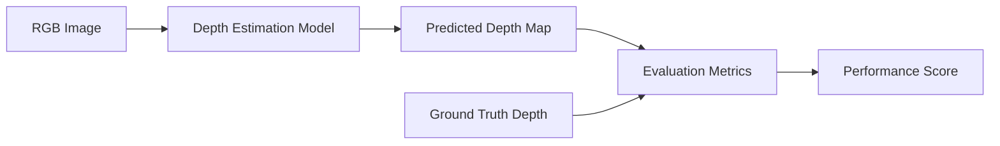

# 📏 Evaluation Metrics

Depth estimation models are evaluated using standardized metrics that measure how accurately they predict the distance between the camera and objects in a scene.

Unlike image classification, there is no single metric that fully describes model performance. Instead, multiple complementary metrics are used to evaluate:

- Overall prediction accuracy
- Relative depth consistency
- Boundary preservation
- Absolute distance estimation
- Computational efficiency
- Real-time capability

---

# 🎯 Why Evaluation Metrics Matter

A visually appealing depth map does **not** always indicate an accurate model.

For robotics and autonomous systems, depth predictions must be:

- Accurate
- Consistent
- Fast
- Robust

Evaluation metrics provide an objective way to compare different models under identical benchmark datasets.

---

# 📊 Evaluation Pipeline



---

# 📚 Categories of Metrics

Depth estimation metrics are generally divided into two groups.

## 1. Monocular Depth Metrics

Used for models that estimate depth from a **single RGB image**.

Examples:

- Depth Anything V2
- MiDaS
- Depth Pro
- Marigold

---

## 2. Stereo Depth Metrics

Used for stereo camera systems.

Example:

- FoundationStereo

---

# 📐 Monocular Evaluation Metrics

## 1️⃣ Absolute Relative Error (AbsRel)

AbsRel measures the average relative difference between the predicted depth and the ground-truth depth.

### Formula

\[
AbsRel = \frac{1}{N}\sum \frac{|D_{pred}-D_{gt}|}{D_{gt}}
\]

### Interpretation

✅ Lower is better

A lower AbsRel means the predicted depth values are closer to the actual distances.

### Typical Values

| Performance | AbsRel |
|-------------|---------|
| Excellent | <0.07 |
| Very Good | 0.07–0.10 |
| Good | 0.10–0.15 |
| Poor | >0.15 |

---

## 2️⃣ Squared Relative Error (SqRel)

SqRel penalizes larger prediction errors more heavily than AbsRel.

### Formula

\[
SqRel=\frac{1}{N}\sum \frac{(D_{pred}-D_{gt})^2}{D_{gt}}
\]

### Interpretation

Lower values indicate:

- Better long-range prediction
- Smaller large-distance errors

---

## 3️⃣ Root Mean Square Error (RMSE)

RMSE measures the overall magnitude of prediction errors.

### Formula

\[
RMSE=\sqrt{\frac{1}{N}\sum(D_{pred}-D_{gt})^2}
\]

### Characteristics

- Penalizes large errors
- Sensitive to outliers
- Widely used across KITTI and NYUv2 benchmarks

Lower RMSE indicates better depth estimation.

---

## 4️⃣ RMSE (Log)

Instead of comparing depth directly, RMSE(Log) compares logarithmic depth values.

Advantages:

- Better evaluation over large depth ranges
- Less sensitive to scale differences
- Commonly reported in monocular depth papers

Lower values are better.

---

## 5️⃣ Threshold Accuracy (δ)

Threshold Accuracy evaluates how many predicted pixels fall within a specified error threshold.

Three commonly reported values are:

- δ₁
- δ₂
- δ₃

### δ₁

A prediction is considered correct when

```
max(
Prediction / Ground Truth,
Ground Truth / Prediction
) < 1.25
```

### Interpretation

Higher is better.

Example:

```
δ₁ = 95%

↓

95% of all pixels

are within

25%

of the true depth.
```

Typical performance:

| Performance | δ₁ |
|-------------|------|
| Excellent | >95% |
| Very Good | 90–95% |
| Good | 85–90% |
| Average | <85% |

---

# 📊 Understanding δ Metrics

| Metric | Threshold |
|---------|-----------|
| δ₁ | 1.25 |
| δ₂ | 1.25² |
| δ₃ | 1.25³ |

δ₂ and δ₃ use progressively larger tolerances.

Therefore,

```
δ₃

≥

δ₂

≥

δ₁
```

Higher values always indicate better performance.

---

## 6️⃣ Boundary F1 Score

Boundary F1 measures how accurately a model preserves object boundaries.

Instead of evaluating all pixels equally, it focuses on edges.

Example:

```
Person

███████

Sharp Boundary ✓

Blurred Boundary ✗
```

Higher F1 indicates:

- Sharper object edges
- Better thin-structure prediction
- Improved segmentation quality

This metric is especially important for:

- Robotics
- Manipulation
- Autonomous driving
- Scene reconstruction

---

# 📷 Stereo Evaluation Metrics

Stereo models estimate disparity before converting it into depth.

Different evaluation metrics are therefore used.

---

## 1️⃣ BP-2 (Bad Pixel 2)

BP-2 measures the percentage of pixels with disparity errors greater than **2 pixels**.

Example:

```
100 Pixels

1 Incorrect

↓

BP-2 = 1%
```

Lower values indicate more accurate stereo matching.

---

## 2️⃣ D1 Error

D1 measures the percentage of pixels whose disparity error exceeds:

- 3 pixels
- AND
- 5% of the true disparity

This is the primary metric used by the KITTI Stereo Benchmark.

Lower is better.

---

## 3️⃣ End Point Error (EPE)

EPE computes the average disparity error across all pixels.

```
Predicted Disparity

↓

Ground Truth

↓

Average Pixel Error
```

Lower values indicate better stereo estimation.

---

# 📊 Relative Depth vs Metric Depth

One of the biggest differences between depth models is the type of depth they produce.

---

## Relative Depth

Relative depth predicts:

- Which objects are nearer
- Which objects are farther

It does **not** estimate the actual physical distance.

Example

```
Person

↓

Closest

Car

↓

Farther

Building

↓

Farthest
```

Models

- MiDaS
- Depth Anything V2
- Marigold
- DepthCrafter

---

## Metric Depth

Metric depth predicts actual distance.

Example

```
Person

↓

2.4 m

Car

↓

9.2 m

Building

↓

38.5 m
```

Essential for

- Robotics
- Drone navigation
- SLAM
- Autonomous driving
- Industrial automation

Models

- Depth Pro
- FoundationStereo

---

# ⚡ Inference Speed

Real-world systems require both accuracy and speed.

Approximate frame rates:

| Time | FPS |
|------|------|
| 1000 ms | 1 FPS |
| 500 ms | 2 FPS |
| 100 ms | 10 FPS |
| 50 ms | 20 FPS |
| 33 ms | 30 FPS |
| 16 ms | 60 FPS |

For embedded robotics:

| Application | Target FPS |
|-------------|------------|
| Mobile Robots | >20 FPS |
| Autonomous Cars | >30 FPS |
| FPV Drones | >30 FPS |
| Edge AI | >15 FPS |

---

# 🗂 Common Benchmark Datasets

Most research papers evaluate models using publicly available datasets.

| Dataset | Environment | Primary Use |
|---------|-------------|-------------|
| KITTI | Outdoor | Autonomous Driving |
| NYUv2 | Indoor | RGB-D Depth Estimation |
| ETH3D | Indoor + Outdoor | High-Accuracy Stereo |
| ScanNet | Indoor | Scene Reconstruction |
| SUN RGB-D | Indoor | Robotics |
| Sintel | Synthetic | Video Depth |
| Scene Flow | Synthetic | Stereo Matching |
| Middlebury | Indoor | Stereo Evaluation |

---

# 📋 Metric Summary

| Metric | Better Value | Measures |
|---------|--------------|----------|
| AbsRel | Lower | Relative depth error |
| SqRel | Lower | Large depth errors |
| RMSE | Lower | Overall prediction error |
| RMSE(Log) | Lower | Scale-aware error |
| δ₁ | Higher | Accurate pixels |
| δ₂ | Higher | Moderate threshold accuracy |
| δ₃ | Higher | Relaxed threshold accuracy |
| Boundary F1 | Higher | Edge quality |
| BP-2 | Lower | Stereo disparity error |
| D1 | Lower | KITTI stereo accuracy |
| EPE | Lower | Average disparity error |

---

# 💡 Which Metrics Matter Most?

| Application | Important Metrics |
|-------------|------------------|
| Robotics | AbsRel, δ₁, FPS |
| Autonomous Driving | D1, BP-2, EPE |
| FPV Drones | AbsRel, FPS |
| AR / VR | RMSE, Boundary F1 |
| 3D Reconstruction | RMSE, F1 |
| Video Depth | Temporal Consistency, FPS |

---

# 📌 Key Takeaways

- **AbsRel** measures overall prediction accuracy.
- **RMSE** evaluates the magnitude of depth errors.
- **δ metrics** indicate the percentage of correctly estimated pixels.
- **Boundary F1** evaluates edge preservation.
- **BP-2**, **D1**, and **EPE** are specific to stereo depth estimation.
- **Inference speed** is equally important for real-time robotic systems.

---

# ➡ Next Section

The next chapter introduces **Depth Anything V2**, covering:

- Model Overview
- Architecture
- Working Principle
- Training Pipeline
- Model Variants
- Strengths
- Weaknesses
- Benchmark Performance
- Deployment Recommendations
- Real-world Applications
