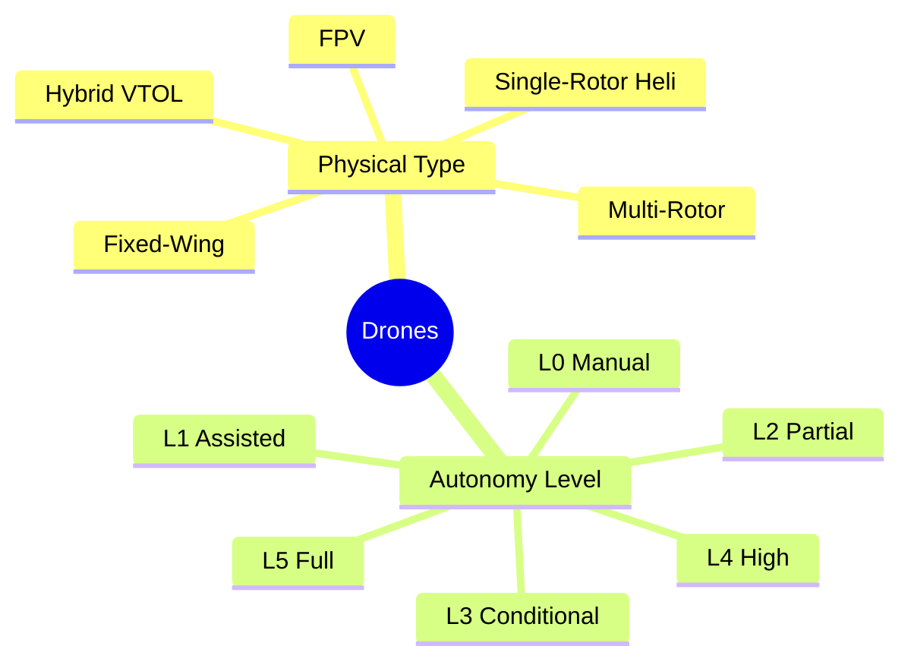
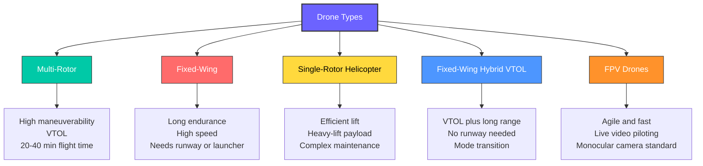
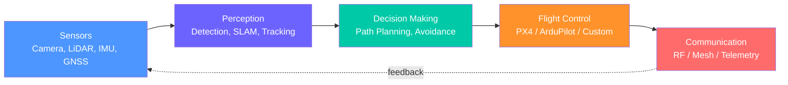
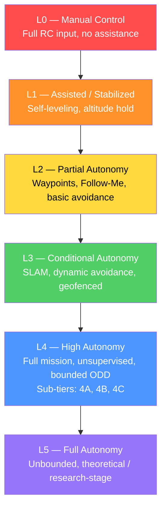
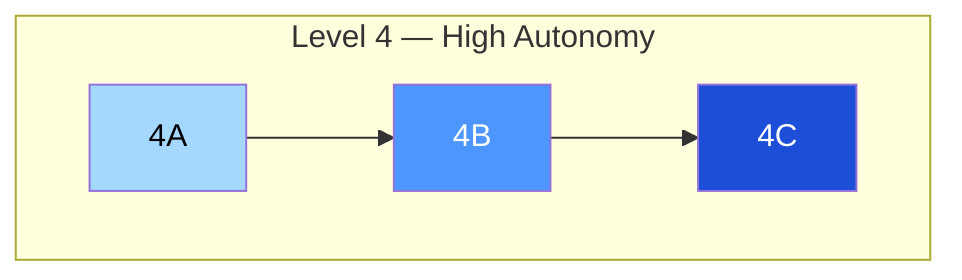
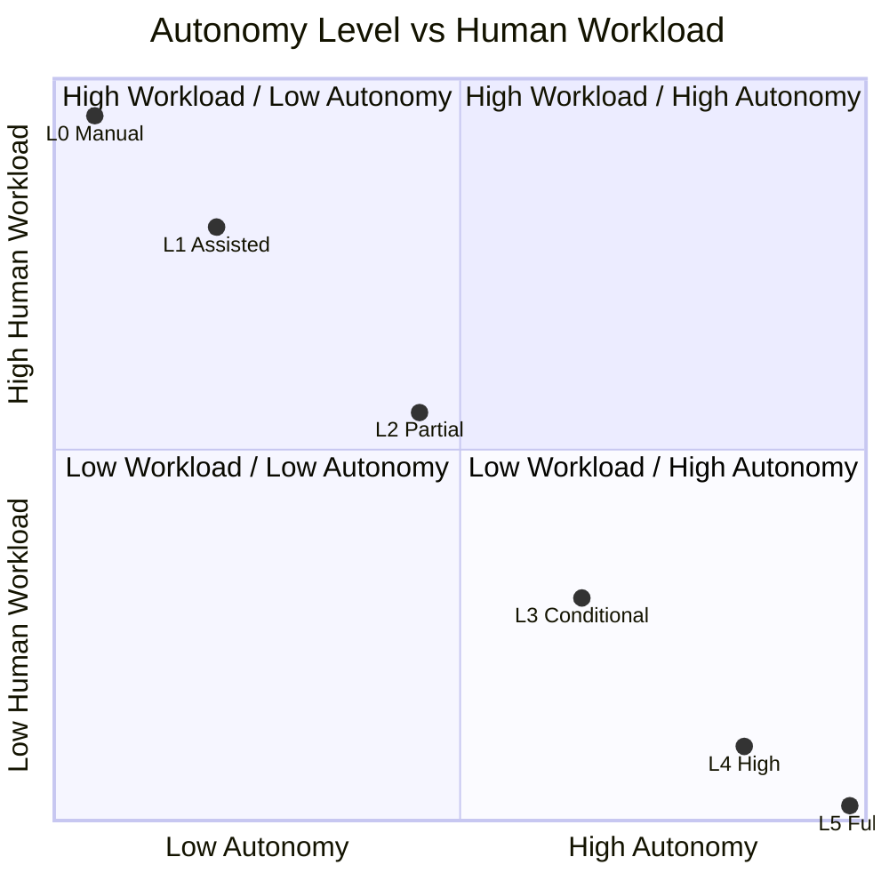
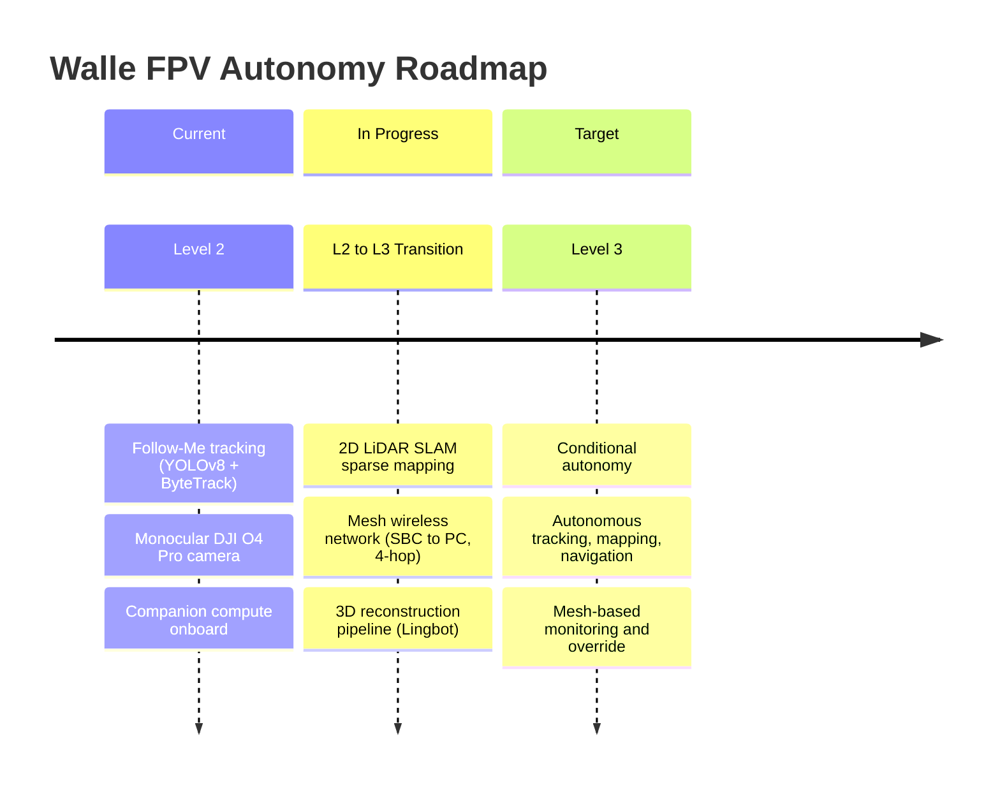

# Walle FPV — Drone Types & Levels of Autonomy

> **Repository:** Walle_FPV
> **Category:** R&D Documentation
> **Camera:** DJI O4 Pro (monocular)
> **Status:** Active Documentation

---

## Table of Contents
- [1. Introduction](#1-introduction)
- [2. Types of Drones](#2-types-of-drones-by-physical-configuration)
- [3. What Are Autonomous Drones?](#3-what-are-autonomous-drones)
- [4. Levels of Drone Autonomy (L0–L5)](#4-levels-of-drone-autonomy-l0--l5)
- [5. Summary Comparison](#5-summary-comparison)
- [6. Walle FPV — Current & Target Mapping](#6-walle-fpv--current--target-autonomy-mapping)
- [7. References](#7-references--frameworks-used)

---

## 1. Introduction

Unmanned Aerial Vehicles (UAVs), commonly known as drones, are classified both by their **physical configuration** (type) and by their **degree of autonomous capability** (level). This document covers both classifications and defines the **six-level autonomy framework (L0–L5)** used to benchmark the Walle FPV platform's current and target capabilities.

---

## 2. Types of Drones (By Physical Configuration)

| Type | Flight Style | Best For | Notes |
|---|---|---|---|
| Multi-Rotor | VTOL, hover | Photography, inspection, FPV racing | Most common; short endurance |
| Fixed-Wing | Forward flight only | Large-area mapping, surveillance | Long range, no hover |
| Single-Rotor Heli | VTOL | Heavy-lift industrial | Mechanically complex |
| Hybrid VTOL | VTOL + forward flight | Long-range delivery | Best of both worlds |
| FPV | VTOL, agile | Racing, close-proximity autonomy | Walle FPV platform |

---

## 3. What Are Autonomous Drones?

An autonomous drone performs part or all of its flight mission — navigation, obstacle avoidance, target tracking, decision-making — **without continuous direct human control**.

Autonomy is **not binary** — it exists on a spectrum, similar in philosophy to the SAE J3016 levels used for autonomous cars.

---

## 4. Levels of Drone Autonomy (L0 – L5)

### Level 0 — No Autonomy (Manual Control)
Fully manual flight. Pilot directly controls all motors via RC transmitter; only basic flight-controller physics (rate/attitude mode) apply.

| Spec | Value |
|---|---|
| Control | Direct RC input (acro/manual mode) |
| Sensors | IMU only (optional) |
| Onboard Compute | None / flight controller only |
| GPS | Not required |
| Use Case | FPV racing, freestyle flying |
| Human Workload | 100% continuous control |

---

### Level 1 — Assisted / Stabilized Flight
Flight controller provides stabilization (self-leveling, altitude hold); pilot makes all navigation decisions.

| Spec | Value |
|---|---|
| Control | RC + stabilization assist (angle/horizon mode) |
| Sensors | IMU, barometer |
| Onboard Compute | Flight controller (STM32-class) |
| GPS | Optional (position hold) |
| Features | Self-leveling, altitude hold, basic RTH |
| Use Case | Consumer flying, beginner FPV |
| Human Workload | High |

---

### Level 2 — Partial Autonomy (Assisted Navigation)
Drone executes automated behaviors (waypoints, Follow-Me, basic obstacle detection) under human supervision.

| Spec | Value |
|---|---|
| Control | GPS waypoint navigation, Follow-Me mode |
| Sensors | GPS/GNSS, IMU, monocular/stereo cam, barometer |
| Onboard Compute | Companion computer (RPi / Jetson Nano) |
| Perception | Object detection (YOLOv8) for subject tracking |
| Features | Waypoint missions, follow-me, stop-and-hover avoidance |
| Use Case | Cinematography, basic inspection |
| Human Workload | Medium |

**Aligns with current Walle FPV Phase 1/2** — detection + ByteTrack tracking.

---

### Level 3 — Conditional Autonomy
Full mission completed autonomously within a defined operational envelope; human on standby to intervene if requested.

| Spec | Value |
|---|---|
| Control | Autonomous mission execution within constraints |
| Sensors | GNSS/VIO, stereo/depth cam or LiDAR, IMU, optical flow |
| Onboard Compute | Mid-tier SBC/GPU (Jetson Orin Nano class) |
| Perception | Real-time detection + tracking + 2D/3D SLAM |
| Features | Dynamic obstacle avoidance, re-routing, re-acquisition, geofencing, fail-safe RTH |
| Communication | Reliable telemetry/mesh link for override |
| Use Case | Search and rescue support, industrial inspection |
| Human Workload | Low (monitor only) |

**Target state for Walle FPV** — mesh network + SLAM sparse mapping + full tracking pipeline.

---

### Level 4 — High Autonomy (Unsupervised, Bounded)
Entire mission — takeoff to landing — executed with no human monitoring, but within a well-defined operational domain (ODD).

| Spec | Value |
|---|---|
| Control | Fully autonomous mission planning and execution |
| Sensors | LiDAR/depth cam, stereo vision, GPS/RTK, IMU, redundant sensors |
| Onboard Compute | High-performance edge AI (Jetson Orin/Xavier or better) |
| Perception | Full SLAM, multi-object detection/tracking, face recognition, 3D reconstruction, dynamic path replanning |
| Features | Swarm coordination, self-diagnosis, fault recovery, goal-based navigation, regulatory compliance |
| Communication | Multi-hop mesh, tolerant to intermittent connectivity |
| Use Case | Autonomous delivery, industrial monitoring, disaster response |
| Human Workload | None (compliance monitoring only) |

#### Level 4 Sub-Tiers (4A / 4B / 4C)

Level 4 is broad, so it is split into three sub-tiers. Each sub-tier is defined along three simple dimensions: **how big an area the drone can operate in, what kind of task it does, and how much backup hardware it carries in case something fails.**

**Level 4A — Site-Level Autonomy**
In simple terms: the drone operates fully on its own, but only inside one small, known area — like a single warehouse, farm, or factory yard. Think of it as "autonomous, but stays in its own backyard."
| Dimension | Description |
|---|---|
| Operational Area | Site-specific (one fixed location, pre-mapped) |
| Typical Task | Single repeated task — e.g., delivery between two fixed points, or patrolling one building |
| Backup Hardware | Basic — one working sensor set is enough, no major backup needed since the area is small and predictable |

**Level 4B — Regional Autonomy**
In simple terms: the drone can now handle a bigger, less predictable area — like an entire city district or a large farm spread across several fields. It also starts doing more varied jobs, not just one repeated task.
| Dimension | Description |
|---|---|
| Operational Area | Regional (multiple connected sites, semi-known terrain) |
| Typical Task | Mixed tasks — e.g., monitoring today, inspection tomorrow, delivery the next day |
| Backup Hardware | Redundant — a spare sensor or backup compute unit is added, so if one part fails mid-flight the drone can still land safely |

**Level 4C — Wide-Area / Multi-Drone Autonomy**
In simple terms: this is the most advanced tier before full autonomy (Level 5). The drone (often working together with other drones as a team) can cover very large, unpredictable areas and keep flying safely even if a major part fails.
| Dimension | Description |
|---|---|
| Operational Area | Wide-area (large, less-mapped regions, changing conditions) |
| Typical Task | Complex/coordinated tasks — e.g., disaster response, swarm search-and-rescue, large-area surveying |
| Backup Hardware | Fail-operational — the drone can lose a sensor or compute unit and still safely continue or land, not just stop and hover |

**Quick Summary Table**

| Sub-Level | Area Covered | Task Style | Backup Level |
|:---:|---|---|---|
| 4A | One site | One repeated task | Basic |
| 4B | Multiple sites (regional) | Mixed tasks | Redundant (spare parts) |
| 4C | Wide area, multi-drone | Complex/coordinated tasks | Fail-operational (keeps working after a failure) |

---

### Level 5 — Full Autonomy (Unbounded)
Currently theoretical — not commercially deployed as of 2026 due to regulatory and safety constraints.

| Spec | Value |
|---|---|
| Control | Complete self-governance, zero ODD restriction |
| Sensors/Compute | Fully redundant, self-healing systems |
| Perception | General-purpose scene understanding, reasoning-level decisions |
| Use Case | Theoretical / research-stage |
| Human Workload | None |
| Status | Not permitted under current DGCA/FAA/EASA frameworks |

---

## 5. Summary Comparison

| Level | Name | Human Role | Key Requirement |
|:---:|---|---|---|
| L0 | Manual | Full control | RC transmitter only |
| L1 | Assisted/Stabilized | Full navigation | IMU, barometer |
| L2 | Partial Autonomy | Active supervision | GPS, monocular cam, companion compute |
| L3 | Conditional Autonomy | Standby/override | SLAM, depth sensing, mesh comms |
| L4 | High Autonomy (4A/4B/4C) | Compliance monitor | Full sensor suite, redundant compute (scales with sub-tier) |
| L5 | Full Autonomy | None | Unrestricted, theoretical |

---

## 6. Walle FPV — Current & Target Autonomy Mapping

| Stage | Capability | Key Modules |
|---|---|---|
| Current | Level 2 | YOLOv8 detection, ByteTrack tracking |
| In Development | L2 → L3 | LiDAR-2D-Map-Sparsing, Mesh Network, Lingbot 3D reconstruction |
| Target | Level 3 | Conditional autonomy within defined operational envelope |

---

## 7. References / Frameworks Used

- Conceptual structure adapted from SAE J3016 (Autonomous Vehicle Levels), applied to aerial robotics context
- Sensor/compute specs based on common UAV autonomy stacks (PX4/ArduPilot ecosystem, NVIDIA Jetson platform documentation)

---

  Part of the Walle_FPV R&D documentation series | Maintained by Arisudan

