# Evaluating Real-Time Object Detection Models for Autonomous Vehicle Vision

---

# Abstract

This paper evaluates five state-of-the-art object detection models—**YOLOv10**, **YOLOv11**, **EfficientDet**, **Faster R-CNN**, and **SSD**—for autonomous vehicle perception. The models are benchmarked using the **Berkeley DeepDrive (BDD100K)** and **iRain** datasets based on **Mean Average Precision (mAP)** and **Frames Per Second (FPS)**. The study concludes that **Faster R-CNN** achieves the highest detection accuracy, while **YOLOv11** provides the best trade-off between accuracy and real-time performance. The paper also discusses deployment using TensorFlow Lite (TFLite) for embedded systems and evaluates robustness under adverse weather conditions.

---

# Analogy

> Imagine five security guards monitoring a busy highway.
>
> - **Faster R-CNN** is the most careful guard—it rarely misses anything but reacts slowly.
> - **SSD** is the fastest guard but occasionally overlooks difficult objects.
> - **EfficientDet** is the energy-efficient guard who performs well without consuming many resources.
> - **YOLOv10** is a fast experienced guard.
> - **YOLOv11** is an upgraded version that is almost as accurate as the careful guard while remaining fast enough for real-time driving.

---

> [!IMPORTANT]
> ## Takeaways
>
> - Compares **five major object detection architectures** for autonomous driving.
> - Benchmarks performance on **BDD100K** and **iRain** datasets.
> - Evaluates the trade-off between **accuracy** and **inference speed**.
> - Demonstrates that **YOLOv11** offers the best overall balance for real-time autonomous driving.
> - Shows the feasibility of deploying trained models using **TensorFlow Lite** on embedded hardware.

---

# Core Concepts – The Glossary

| Term | Simple Definition | Why it Matters |
|------|-------------------|----------------|
| CNN | Convolutional Neural Network | Backbone for feature extraction |
| Object Detection | Identifying objects and locating them with bounding boxes | Fundamental perception task |
| One-Stage Detector | Performs localization and classification simultaneously | Faster inference |
| Two-Stage Detector | Generates proposals before classification | Higher localization accuracy |
| mAP | Mean Average Precision | Standard accuracy metric |
| FPS | Frames Per Second | Measures real-time capability |
| NMS | Non-Maximum Suppression | Removes duplicate detections |
| RPN | Region Proposal Network | Generates object proposals in Faster R-CNN |
| BiFPN | Bidirectional Feature Pyramid Network | Improves multi-scale feature fusion |
| CSPNet | Cross Stage Partial Network | Enhances feature extraction efficiency |
| TFLite | TensorFlow Lite | Optimized deployment framework for edge devices |

---

# How it Works

## Data Pipeline

1. Capture road images using onboard vehicle cameras.
2. Train object detection models independently using:
   - Berkeley DeepDrive (BDD100K)
   - iRain Dataset
3. Extract visual features using CNN backbones.
4. Generate bounding boxes and object classifications.
5. Convert trained models into **TensorFlow Lite (.tflite)** format.
6. Deploy models onto GPUs or embedded edge devices.
7. Evaluate:
   - Mean Average Precision (mAP)
   - Frames Per Second (FPS)
   - Performance under rainy conditions

## Detection Pipeline

```mermaid
flowchart LR

A[Vehicle Camera]
-->|"Capture Frames"| B[BDD100K / iRain Dataset]

B
-->|"Training"| C[Object Detection Model]

C
-->|"Feature Extraction"| D[Backbone CNN]

D
-->|"Multi-scale Features"| E[Detection Head]

E
-->|"Bounding Boxes + Classes"| F[Predictions]

F
-->|"Convert to TFLite"| G[Embedded Deployment]

G
-->|"Real-Time Detection"| H[Autonomous Vehicle]
```

> [!IMPORTANT]
>
> The paper's primary contribution is a comprehensive comparison of modern object detectors for autonomous vehicle perception, demonstrating that **YOLOv11** provides the best compromise between detection accuracy and real-time speed.

---

# Technical Architecture

## Key Components

- Vehicle Camera
- Berkeley DeepDrive Dataset
- iRain Dataset
- CNN Backbone
- Multi-scale Feature Fusion
- Detection Head
- TensorFlow Lite Converter
- Edge Device Deployment
- Real-Time Inference Engine

## Architecture Table

| Module | Input | Core Operation | Output | Tensor Shape |
|---------|-------|----------------|--------|--------------|
| Vehicle Camera | RGB Image | Image Acquisition | Input Frame | H × W × 3 |
| Backbone CNN | Image | Feature Extraction | Feature Maps | H/32 × W/32 × C |
| Neck (BiFPN/FPN/CSP) | Feature Maps | Multi-scale Fusion | Pyramid Features | Multi-scale |
| Detection Head | Pyramid Features | Classification + Bounding Box Regression | Predictions | N × (Class + Box) |
| Post-processing | Predictions | NMS (except YOLOv10) | Final Detections | Variable |
| TensorFlow Lite Converter | Trained Model | Model Optimization | .tflite Model | — |
| Edge Device | TFLite Model | Real-Time Inference | Detected Objects | Variable |

---

# Summary of Experimental Results

| Model | Berkeley mAP | iRain mAP | FPS | Detector Type |
|--------|--------------|-----------|-----|---------------|
| Faster R-CNN | **82.34** | 78.22 | 12 | Two-Stage |
| SSD | 73.82 | 67.94 | **60** | Single-Stage |
| EfficientDet | 77.12 | 73.85 | 40 | Single-Stage |
| YOLOv10 | 75.23 | 73.26 | 50 | Single-Stage |
| **YOLOv11** | **80.21** | **78.87** | 45 | Single-Stage |

## Performance Comparison

| Dataset | Metric | Best Model | Observation |
|---------|--------|------------|-------------|
| Berkeley DeepDrive | mAP | Faster R-CNN | Highest detection accuracy |
| iRain | mAP | YOLOv11 | Most robust under rainy conditions |
| Real-Time Inference | FPS | SSD | Highest processing speed |
| Overall Balance | Accuracy + Speed | YOLOv11 | Best practical detector |

> [!TIP]
>
> **The Bottom Line**
>
> - Highest Accuracy → **Faster R-CNN**
> - Fastest Detector → **SSD**
> - Best Resource Efficiency → **EfficientDet**
> - Best Overall Choice → **YOLOv11**

---

# Why This Matters (Impact Analysis)

Reliable object detection is essential for autonomous vehicles operating in dynamic environments. This comparison provides practical guidance for selecting an appropriate detector based on application requirements.

**Suggested Starter Project**

Train **YOLOv11** on the BDD100K dataset, export the model to **TensorFlow Lite**, and benchmark its FPS and latency on an embedded platform such as NVIDIA Jetson or Raspberry Pi.

---

# Learning Path – How to Replicate

## Module 1 – Computer Vision Fundamentals

- Convolutional Neural Networks
- Feature Maps
- Bounding Boxes
- IoU
- mAP

## Module 2 – Modern Object Detection

- Faster R-CNN
- SSD
- EfficientDet
- YOLO Family
- Feature Pyramid Networks
- CSPNet

## Module 3 – Edge AI Deployment

- TensorFlow Lite
- ONNX
- Model Quantization
- Model Pruning
- Embedded GPU Optimization

---

> [!WARNING]
>
> ## Limitations
>
> - Evaluation uses only BDD100K and iRain datasets.
> - No detailed hardware latency or power consumption analysis.
> - Focuses solely on object detection without tracking or segmentation.
> - Exact tensor dimensions are not provided.
> - Weather evaluation is primarily limited to rainy conditions.

---

# Quick Reference – Key Terms

- **CNN** — Convolutional Neural Network
- **YOLO** — You Only Look Once
- **SSD** — Single Shot MultiBox Detector
- **RPN** — Region Proposal Network
- **RoI** — Region of Interest
- **BiFPN** — Bidirectional Feature Pyramid Network
- **CSPNet** — Cross Stage Partial Network
- **FPS** — Frames Per Second
- **mAP** — Mean Average Precision
- **IoU** — Intersection over Union
- **TFLite** — TensorFlow Lite
- **BDD100K** — Berkeley DeepDrive 100K Dataset

---

