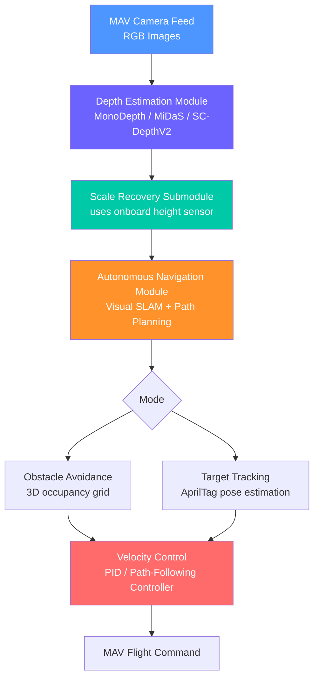

# Paper Notes — MoNA Bench: A Benchmark for Monocular Depth Estimation in Navigation of Autonomous Unmanned Aircraft Systems

> **Repository:** Walle_FPV
> **Category:** R&D Reference / Literature Notes
> **Relevance:** Monocular depth estimation, scale recovery, obstacle avoidance, target tracking on a monocular-camera MAV — directly applicable to the Walle FPV (DJI O4 Pro, monocular) pipeline.
> **Status:** Reference document, not original work

---

## 1. Citation

| Field | Detail |
|---|---|
| Title | MoNA Bench: A Benchmark for Monocular Depth Estimation in Navigation of Autonomous Unmanned Aircraft System |
| Authors | Yongzhou Pan, Binhong Liu, Zhen Liu, Hao Shen, Jianyu Xu, Wenxing Fu, Tao Yang |
| Affiliation | Unmanned System Research Institute, Northwestern Polytechnical University, Xi'an, China |
| Journal | *Drones*, 2024, 8, 66 |
| DOI | 10.3390/drones8020066 |
| License | CC BY 4.0 (open access) |
| Code Repository | https://github.com/npu-ius-lab/MoNA-Bench |
| Published | 16 February 2024 |

---

## 2. Why This Paper Is Relevant to Walle FPV

Walle FPV also relies on a single monocular camera (DJI O4 Pro) for perception. This paper tackles the exact core problem that a monocular-only pipeline runs into: **scale ambiguity** — a monocular camera can tell you the *shape* of a scene but not the *real-world size/distance* without extra information. Their solution (fusing a height sensor reading with the predicted depth map to recover a scale factor) is a directly transferable technique for Walle FPV's object detection, tracking, and 3D reconstruction modules, all of which currently lack an independent metric-scale reference.

---

## 3. Problem Statement

Autonomous drones need reliable depth perception to plan safe flight paths. Most systems get this from LiDAR, stereo cameras, or RGB-D sensors, all of which give distance directly in real-world units (metric scale). A monocular camera cannot do this natively — it only recovers *relative* depth, not absolute distance — yet monocular cameras remain the sensor of choice for small drones because of their low weight, low power draw, and rich visual detail. The paper's core contribution is a system and a benchmark (called **MoNA Bench**) that recovers real-world scale from a single camera feed and evaluates how well different monocular depth estimation (MDE) algorithms support two downstream flight behaviors: obstacle avoidance and safe target tracking.

---

## 4. System Architecture

The proposed system runs on a ground server that receives a live video stream from the drone and sends back velocity commands. It is composed of four modules:

### 4.1 Hardware Platform
| Component | Spec |
|---|---|
| Drone | DJI RoboMaster TT Tello Talent |
| Weight | ~80 g (with propellers and battery) |
| Camera | 5 MP monocular, 82.6° field of view, up to 720p/30fps |
| Height Sensor | Time-of-Flight (ToF) infrared distance sensor |
| Link | 2.4 GHz WiFi (control), 5 GHz WiFi (video, up to 100 m range with expansion module) |
| Ground Server | Intel i7-10875H CPU, NVIDIA RTX 2070 Super GPU (8 GB) |
| Software Stack | Ubuntu 18.04, ROS Melodic |

### 4.2 Processing Pipeline (5 steps)
1. **System connection** — drone connects over WiFi, streams RGB, hovers at ~0.9 m.
2. **Depth estimation** — a monocular depth network (MonoDepth, MiDaS, or SC-DepthV2) predicts a dense depth map; a scale recovery submodule then converts the depth map to a point cloud, segments the ground plane using RANSAC, transforms it into the drone's body frame, and computes a scale factor by comparing the sensor-measured height to the ground plane's depth-derived height.
3. **Autonomous navigation** — ORB-SLAM2 estimates the camera's 6-degree-of-freedom pose using the scaled depth maps; this pose feeds either an obstacle-avoidance planner (Fast-Planner) or a target-tracking planner (Fast-Tracker).
4. **Pose estimation** — an AprilTag fiducial marker is used as the tracked target, giving a reliable ground-truth-scale position to validate the system against.
5. **Velocity control** — a PID controller or path-following controller converts the planned trajectory into motor commands.

### 4.3 Scale Recovery Method (Key Technique)
This is the part most transferable to Walle FPV:
1. Convert predicted depth map → 3D point cloud using camera intrinsics.
2. Segment the ground plane out of that point cloud via RANSAC.
3. Transform the ground points from camera coordinates into the drone's body coordinate frame.
4. Compare the *relative* height derived from the point cloud to the *actual metric* height from the onboard ToF sensor — the ratio between the two gives the scale factor.
5. Apply that scale factor to the entire depth map, converting relative depth into real-world metric depth.

---

## 5. Monocular Depth Estimation Algorithms Compared

| Algorithm | Learning Type | Training Data | Known For |
|---|---|---|---|
| MonoDepth | Supervised | NYUv2 | Sharp object boundaries, transfer-learning based, fewer parameters |
| MiDaS | Supervised (cross-dataset) | 6 mixed datasets | Strong generalization across domains, but less scale-stable |
| SC-DepthV2 | Self-supervised | NYUv2 | Geometric consistency loss for scale-consistent depth across frames; auto-rectifies camera-motion noise indoors |

---

## 6. Experimental Setup

Three test scenarios were built, each with obstacles placed at fixed distances (2 m, 3 m, 4.5 m, 6 m) in front of the drone, under well-lit indoor conditions:
- **Estimation performance test** — drone hovers at a fixed point, 500 consecutive frames evaluated per algorithm.
- **Obstacle avoidance test** — 9 flights per algorithm, success defined as clearing 3 obstacles.
- **Target tracking test** — drone must track an AprilTag target while avoiding the same obstacles.

Only pre-trained models were used (no fine-tuning on the test environment).

---

## 7. Evaluation Metrics Used (MoNA Bench)

| Metric | What It Measures |
|---|---|
| GPU Occupancy (%) | Compute cost of running the MDE model |
| Average Publication Frequency (APF, Hz) | How fast the depth model can output frames |
| Data Utilization Rate (DUR, %) | Ratio of depth output rate to camera input rate (30 Hz) — how much of the incoming video the model can actually keep up with |
| Coefficient of Variation (CV, %) | Stability of the computed scale factor over time — lower is more stable |
| Average Relative Error (ARE, %) | How far the predicted obstacle distance is from the true distance, per test distance (2/3/4.5/6 m) |
| Obstacle Avoidance Success Rate (%) | Percentage of flights that cleared all 3 obstacles without collision |
| Safe Tracking (boolean) | Whether the algorithm could support simultaneous target tracking + obstacle avoidance |

---

## 8. Key Results

### 8.1 Depth Estimation Accuracy
| Algorithm | GPU Occupancy | Scale Factor CV | ARE @2m | ARE @3m | ARE @4.5m | ARE @6m |
|---|---|---|---|---|---|---|
| MonoDepth | 81–89% | 1.5% | 16.6% | 1.5% | 12.8% | 11.7% |
| MiDaS | 31–35% | 9.7% | 55.7% | 124.6% | 117.8% | 81.9% |
| SC-DepthV2 | 32–34% | 1.0% | 2.5% | 3.5% | 17.7% | 31.8% |

**Takeaway:** SC-DepthV2 was the most accurate at close range and had the most stable scale factor; MiDaS was the least reliable for metric-scale recovery despite strong general-purpose depth quality; MonoDepth was accurate but computationally expensive (highest GPU load).

### 8.2 Navigation Performance
| Algorithm | Publish Rate | Data Utilization | Scale CV (Navigation) | Obstacle Avoidance Success | Safe Target Tracking |
|---|---|---|---|---|---|
| MonoDepth | 8.2 Hz | 26.7% | 6.3% | 55.6% | Not achieved |
| MiDaS | 30.0 Hz | 100% | 39.4% | 11.1% | Not achieved |
| SC-DepthV2 | 30.0 Hz | 100% | 5.0% | 77.8% | Achieved |

**Takeaway:** SC-DepthV2 was the only algorithm that met real-time throughput (100% data utilization) *and* kept the scale factor stable enough to support both obstacle avoidance and simultaneous target tracking. MonoDepth's high GPU cost caused it to fall behind the incoming video stream, losing most of the frames (~73%). MiDaS kept up with the frame rate but its unstable depth/scale predictions produced a distorted 3D map, causing most avoidance attempts to fail.

### 8.3 Point Cloud Quality (Qualitative)
MonoDepth and SC-DepthV2 produced point clouds with a spatial layout that reasonably matched real obstacle positions. MiDaS's point cloud came out as a distorted "V" shape, which the authors attribute to its unstable frame-to-frame depth scale — this made its raw output unsuitable for direct use in navigation without additional preprocessing.

### 8.4 Fixed vs. Dynamic Scale Factor
Because SC-DepthV2's scale factor stayed consistently close to a fixed value across a flight, the authors tested locking the scale factor to a fixed mean value instead of recomputing it every frame. This gave the same navigation performance while cutting ground-station CPU load from ~100% to ~80% — suggesting that once an algorithm proves scale-consistent, fixing the scale factor is a valid way to reduce compute cost.

---

## 9. Failure Modes Identified

| Failure Type | Cause |
|---|---|
| Localization Error | Ground server couldn't process the incoming frames fast enough (high GPU load) → lost feature points → SLAM localization failure |
| Detection Error | Predicted depth map didn't match real obstacle boundaries/gaps closely enough → collisions |
| Other | General MAV instability/wobble during flight |

---

## 10. Conclusions Drawn by the Authors

The authors conclude that an MDE algorithm needs to be strong in three specific attributes to be usable for real-time autonomous navigation on a monocular drone:
1. **Estimation efficiency** — can it run fast enough to keep up with the camera's frame rate without overloading the compute hardware?
2. **Depth map accuracy** — are the predicted distances close to real distances, especially at close range where collision risk is highest?
3. **Scale consistency** — does the scale factor stay stable frame-to-frame, rather than drifting or jumping?

Of the three algorithms tested, SC-DepthV2 was the only one to score well across all three, making it their recommended choice.

---

## 11. Applicability to Walle FPV — Notes for Future Work

- The **scale recovery method** (depth map → point cloud → RANSAC ground segmentation → body-frame transform → scale factor from known height) is directly reusable if the Walle FPV platform has (or adds) a height/altitude sensor independent of the camera — this would solve the same monocular scale-ambiguity problem currently present in the object detection, tracking, and Lingbot 3D reconstruction modules.
- Their three evaluation attributes (**efficiency, accuracy, scale consistency**) line up well with the metrics already defined in Walle FPV's own P0 Object Detection evaluation criteria and could be adapted into similar CV/ARE-style metrics for the 3D reconstruction module's scale-error reporting.
- The **fixed vs. dynamic scale factor** finding is worth testing on Walle FPV once a scale-consistent depth model is chosen — it's a cheap way to cut onboard/ground compute load.
- Their **failure mode categories** (localization error, detection error, other) are a good template to reuse for Walle FPV's own failure-mode-analysis section in evaluation reports.

---

## 12. Reference

Pan, Y.; Liu, B.; Liu, Z.; Shen, H.; Xu, J.; Fu, W.; Yang, T. MoNA Bench: A Benchmark for Monocular Depth Estimation in Navigation of Autonomous Unmanned Aircraft System. *Drones* **2024**, *8*, 66. https://doi.org/10.3390/drones8020066

---

  Part of the Walle_FPV R&D literature notes | Maintained by Arisudan

