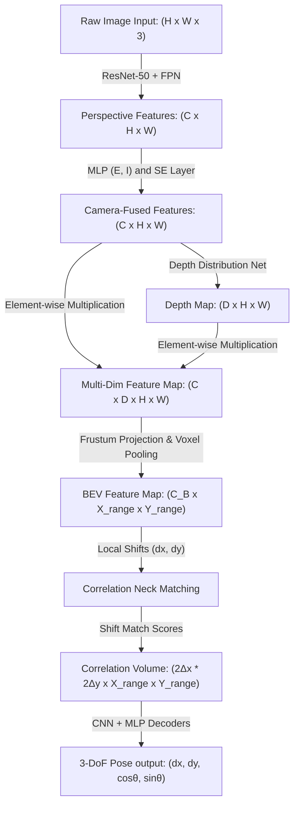

# BEV-ODOM: Reducing Scale Drift in Monocular Visual Odometry with BEV Representation

This technical guide offers a structured onboarding reference for research engineers analyzing the BEV-ODOM framework. It details the underlying mathematical concepts, the engineering architecture, and the specific novel contributions introduced by the authors to mitigate scale drift in single-camera motion estimation.

---

## 1. The 'Big Picture' (Abstract for Beginners)

Monocular Visual Odometry (MVO) tracks a camera's position and orientation using a single video stream. In autonomous driving, this represents a highly cost-effective tracking solution. However, MVO faces a fundamental limitation: **scale ambiguity**. Because a single 2D camera sensor projects the 3D world onto a flat plane, depth information is lost. The system cannot determine if a camera is moving rapidly past large objects or slowly past small objects. 

As a vehicle moves, minor tracking inaccuracies accumulate over time. This compounding error is known as **scale drift**. 

### The Real-World Analogy
> 🚶 **The Ground-Grid Analogy:**
> Consider navigating a low-contrast environment using only forward-facing visual feedback. Estimating the exact distance traveled is highly inaccurate due to perspective distortion. 
> 
> However, if you project the camera view onto a flat, top-down coordinate grid on the ground plane, tracking changes. By matching visual landmarks directly against this consistent ground grid, the absolute scale is preserved, preventing the accumulated trajectory from drifting.

**BEV-ODOM** implements this top-down projection. It converts standard perspective-view images into a scale-consistent **Bird's Eye View (BEV)** representation. By registering these top-down feature maps across sequential frames, the framework estimates relative movement with high scale consistency without requiring expensive auxiliary sensors like LiDAR or stereo cameras.

---

## 2. Core Concepts: The Glossary

| Term | Simple Definition | Why it matters in this context |
| :--- | :--- | :--- |
| **Monocular Visual Odometry (MVO)** | Estimating camera motion over time using a single video feed. | Provides a low-cost tracking solution but suffers from severe scale drift. |
| **Scale Drift** | The accumulation of translation estimation errors over time. | Leads to trajectory deformation and incorrect mapping if left uncorrected. |
| **Bird's Eye View (BEV)** | A top-down projection of a 3D scene onto a 2D horizontal plane. | Simplifies motion estimation to three degrees of freedom (planar translation and rotation). |
| **Lift-Splat-Shoot (LSS)** | An encoding technique that lifts 2D pixels to 3D frustum space and splats them into a BEV grid. | Forms the foundational projection mechanism to generate the top-down representation. |
| **Correlation Volume** | A multi-dimensional matrix of feature similarity scores across local spatial offsets. | Quantifies the relative visual displacement between consecutive frames. |
| **Pose Supervision** | Optimizing neural networks using ground truth trajectory poses instead of depth maps. | Minimizes data annotation costs by removing the need for dense depth sensors. |

---

## 3. How It Works (The 'Under the Hood' Breakdown)

### Data Transformation Pipeline (Tensor Flow Chart)
This diagram illustrates the step-by-step tensor conversions as a single camera frame progresses through the system:

---

> ### 💡 Core Innovation: Self-Supervised Depth Estimation via Pose Gradients
> Traditional BEV encoders require dense depth maps (e.g., from LiDAR) for training. BEV-ODOM optimizes its depth projection network implicitly. Because the entire pipeline is fully differentiable, errors in pose prediction backpropagate through the correlation layers directly into the depth-distribution head. The network learns correct depth metrics simply by optimizing trajectory accuracy.

---

## 4. Technical Architecture

The technical implementation is divided into three key blocks:

### 1. Visual BEV Encoder (Borrowed & Modified Components)
* **Backbone:** **ResNet-50** combined with a **Feature Pyramid Network (FPN)** to extract multi-scale visual representations.
* **Camera Encoder:** A Multi-Layer Perceptron (MLP) coupled with a **Squeeze-and-Excitation (SE)** layer to modulate feature channels based on camera mounting positions.
* **Projector:** A depth-based **Lift-Splat-Shoot (LSS)** projection framework that generates the $128 \times 128$ BEV grid.

### 2. Correlation Feature Extraction Neck (Custom Implementation)
* **Search Window:** Implements a localized $7 \times 7$ shift range ($\pm \Delta x, \pm \Delta y$) to calculate visual displacements, reducing computational overhead compared to global correlation networks.
* **Output:** Generates a 4D correlation matrix mapping the relative spatial displacements.

### 3. Pose Prediction Decoder (Custom Implementation)
* **Structure:** A sequential network of 2D convolutional layers followed by Fully Connected layers.
* **Output Layer:** Features a `tanh` activation function to normalize translational and rotational bounds, enhancing robustness against motion outliers.

### Module Input / Output Architecture Reference

| Module / Layer | Inputs | Core Operation | Outputs | Tensor Dimensions |
| :--- | :--- | :--- | :--- | :--- |
| **Image Backbone** | Raw camera frame | Feature extraction using ResNet-50 & FPN | Multi-scale perspective features | $C \times H \times W$ |
| **Camera Parameter Fusion** | Perspective features & Camera calibration ($E, I$) | Camera parameter encoding via MLP & Squeeze-and-Excitation (SE) multiplication | Scale-adjusted perspective feature maps | $C \times H \times W$ |
| **Depth Predictor** | Scale-adjusted feature maps | Unsupervised depth distribution probability modeling | Probabilistic depth map | $D \times H \times W$ |
| **Voxel Pooler** | Depth map & Scale-adjusted features | Frustum projection followed by vertical pooling (z-axis collapse) | 2D Bird's Eye View (BEV) map | $C_B \times X_{range} \times Y_{range}$ |
| **Correlation Neck** | BEV maps at frame $t$ and $t+1$ | Local relative shifting ($\pm \Delta x, \pm \Delta y$) and inner-product calculations | 4D Correlation Volume containing matching scores | $2\Delta_x \cdot 2\Delta_y \times X_{range} \times Y_{range}$ |
| **Pose Decoder** | 4D Correlation Volume | Convolutional pooling followed by fully connected layers with `tanh` activations | Planned translations and rotation predictions | $d_x, d_y, \cos \theta, \sin \theta$ |

---

## 5. Summary of Experimental Results

The BEV-ODOM framework was benchmarked against geometric methods (**ORB-SLAM3**) and learning-based visual odometry pipelines (**DF-VO**, **DROID-SLAM**).

* **Datasets Tested:** NCLT (severe platform vibration and lighting changes), Oxford RobotCar (complex urban paths), and KITTI (standard highway trajectories).
* **Metrics:** Relative Translation Error (**RTE %**) and Absolute Trajectory Error (**ATE meters**).

### Performance Table

| Dataset | Metric | ORB-SLAM3 | DF-VO | DROID-SLAM | **BEV-ODOM (Ours)** |
| :--- | :--- | :--- | :--- | :--- | :--- |
| **NCLT** *(High Vibration)* | **RTE (%)** | Failed | 41.03% | 44.17% | **4.75%** |
| | **ATE (m)** | Failed | 414.64m | 245.05m | **56.77m** |
| **Oxford** *(Urban driving)* | **RTE (%)** | 952.41% | 28.26% | 136.58% | **6.54%** |
| | **ATE (m)** | 5547.81m | 158.55m | 1184.86m | **93.77m** |
| **KITTI** *(Highway)* | **RTE (%)** | 3.31% | 2.07% | 21.01% | **1.72%** |
| | **ATE (m)** | 6.11m | 7.72m | 73.70m | **6.35%** |

---

## 6. Why This Matters (Impact Analysis)

* **Autonomous Driving Utility:** The framework eliminates the requirement for high-cost active sensor suites (like LiDAR arrays) or complex, memory-intensive backend bundle adjustments. It enables lightweight, camera-only navigation systems to achieve metric-scale tracking accuracy.
* **Onboarding Project Step:**
  As a starting task, implement a Python script using OpenCV to compute a perspective-to-homographic BEV transformation on a public road dataset. Calculate the homography matrix using camera extrinsics and visualize the mapping of perspective lane markings into parallel lines in the top-down frame.

---

## 7. Learning Path: How to Replicate

To reproduce or extend this work, study these foundational modules:

1. **Epipolar Geometry and Projective Transformation:** Understand the mathematics of homographies, coordinate projection, camera intrinsics ($K$), and extrinsics ($[R \mid t]$).
2. **Lift-Splat-Shoot (LSS) Abstractions:** Review the original LSS framework (Philion & Fidler, 2020) to understand how 2D visual features project onto a discretized 3D voxel grid.
3. **Feature Correlation and Flow Matching:** Study local search architectures and correlation volumes to understand how frame-to-frame displacement vectors are computed.

---

## 8. Where It Falls Short (Limitations)

While BEV-ODOM represents a significant improvement in reducing scale drift, it exhibits several core technical limitations:
* **Planar Ground Assumption (3-DoF Limitation):** The model is optimized strictly for 3-Degrees of Freedom movement ($d_x, d_y$, and yaw angle $\theta$). It assumes the vehicle moves on a flat surface and does not account for pitch, roll, or vertical z-axis translations.
* **Vulnerability to Slopes and Elevation Changes:** During evaluations on steep environments (such as the hilly terrain in KITTI Sequence 10), translation accuracy degrades due to the lack of z-axis modeling.
* **Sensitivity to Rapid Rotations:** Large angular transitions between consecutive frames can lead to matching failures in the localized $7 \times 7$ correlation window.

---

## Quick Reference: Key Terms

* **MVO:** Monocular Visual Odometry
* **BEV:** Bird's Eye View
* **Scale Drift:** Progressive accumulation of distance errors over time
* **LSS:** Lift-Splat-Shoot projection algorithm
* **Correlation Volume:** Matrix tracking pixel matches across spatial shifts
* **3-DoF:** Planar tracking restricted to $x$, $y$, and yaw angle ($\theta$)

---

<a href="https://github.com/Arisudan"></a>

