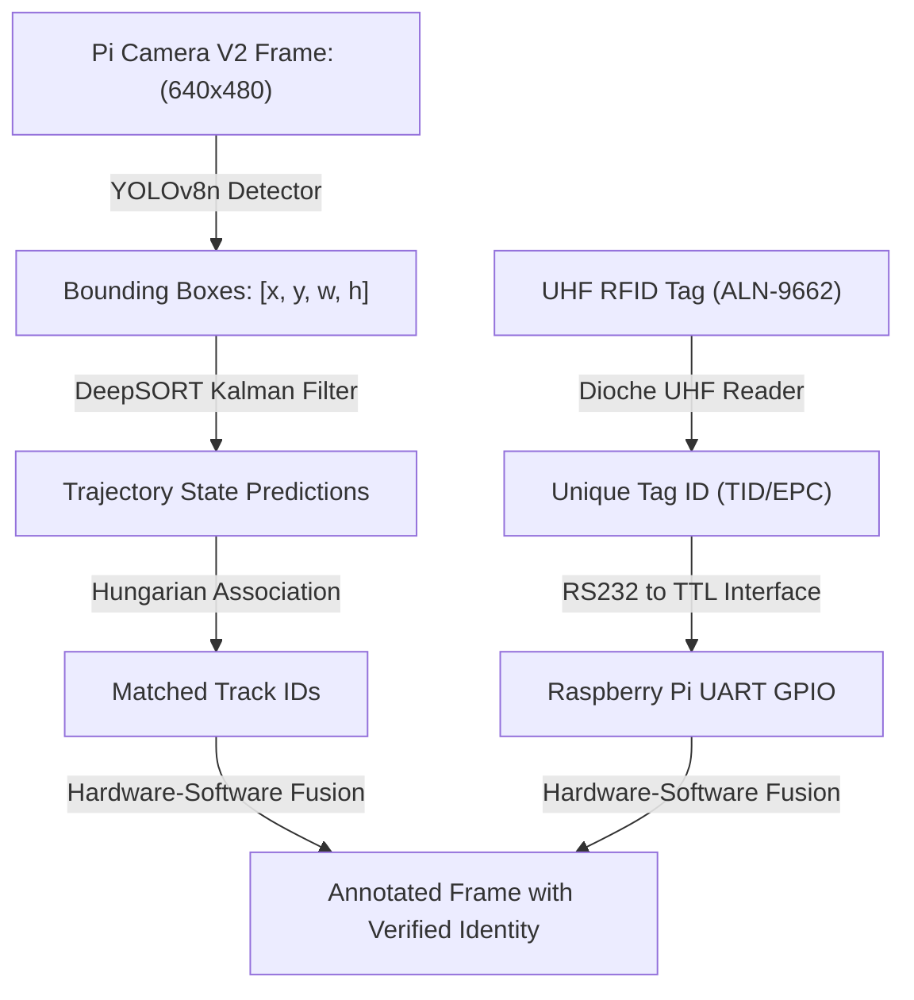

# Integration of DeepSORT and RFID Technology for Enhanced Human Tracking

A concise reference guide evaluating a hybrid human tracking node that combines YOLOv8n, DeepSORT, and UHF RFID technology on low-power edge hardware.

---

## 1. Abstract

Visual tracking systems often experience tracking failures due to occlusion, lighting changes, and motion blur. In high-security environments, visual-only tracking can result in critical identity switches.

To resolve these errors, this paper presents a hardware-software integrated tracking node. It deploys **YOLOv8n** (object detection) and **DeepSORT** (visual tracking) on a **Raspberry Pi 3 Model B+** combined with a **UHF RFID Reader**. By reading unique, battery-free passive RFID tags carried by targets, the system cross-references visual tracks with hardware-level identity coordinates, guaranteeing robust verification at low cost.

> [!NOTE]
> ### 🚶 The Subway Gate Analogy
> Imagine securing a subway gate. You have a security camera (YOLOv8 + DeepSORT) that spots passengers and tracks their paths. However, if two people wearing identical jackets walk past each other, the camera might swap their identities. 
> 
> To solve this, each passenger carries a passive transit pass (RFID tag). When they step near the gate, a scanner reads their unique card ID. The system matches the camera's visual track with the card's electronic ID to ensure 100% correct identification, even if they look identical.

> [!IMPORTANT]
> ### What the Integrated Node Accomplishes
> 1. **Visual Target Detection:** Deploys YOLOv8n on edge hardware, achieving **0.992 mAP50** on custom human datasets.
> 2. **Continuous Trajectory Mapping:** Tracks individuals at 30 fps using DeepSORT.
> 3. **Hardware ID Verification:** Queries passive, battery-free UHF tags (ALN-9662) via serial communication.
> 4. **Low-Power Edge Deployment:** Runs the entire pipeline on a cheap, single-board Raspberry Pi 3 B+.

---

## 2. Core Concepts: The Glossary

| Term | Simple Definition | Why it matters |
| :--- | :--- | :--- |
| **UHF RFID** | Ultra-High Frequency Radio Frequency Identification | Electromagnetic data capture operating at 860-960 MHz using passive tags. |
| **YOLOv8n** | YOLOv8 Nano model | The smallest variant of YOLOv8, optimized for real-time edge processing. |
| **DeepSORT** | Deep Simple Online Realtime Tracker | A visual tracker that uses bounding box overlap and deep visual embeddings. |
| **Raspberry Pi 3 B+** | Single-board credit-card-sized computer | Serves as the low-cost, low-power edge CPU for the system. |
| **RS232 to TTL Converter** | Serial communication adapter | Translates reader voltages to Pi-compatible UART logic levels. |
| **MOTA** | Multi-Object Tracking Accuracy | Measures tracker performance by penalizing ID switches and false outputs. |
| **EPC Class1 Gen2** | Global RFID hardware standard | Ensures communication compatibility between tags and readers. |

---

## 3. How it Works

### Data Pipeline (Tensor Flow Chart)

---

> [!IMPORTANT]
> ### 💡 Core Innovation: Visual-RF Hardware Association
> Rather than relying purely on computer vision to maintain identity under occlusions, the system couples visual tracks with RF signals. When a person enters the camera's field of view, the YOLOv8n-DeepSORT pipeline assigns a temporary visual ID. As the target approaches the UHF reader, the serial interface reads their tag's unique EPC code and locks it to the visual trajectory, resolving visual-only ambiguity.

---

## 4. Technical Architecture

### Module Input / Output Reference

| Module | Inputs | Core Operation | Outputs | Tensor / Data Shapes |
| :--- | :--- | :--- | :--- | :--- |
| **Pi Camera V2** | Visual scene | Video frame capture at 640x480p90 | Image frame | $640 \times 480 \times 3$ |
| **YOLOv8n Detector** | Image frame | Deep feature extraction and bounding-box regression | Person bounding boxes | $N \times 4$ |
| **DeepSORT Tracker** | Bounding boxes | Kalman state prediction and Hungarian matching | Trajectory IDs | Trajectories ($T$) |
| **UHF RFID Reader** | Electromagnetic field | RF query of passive tag IC registers | Tag EPC / TID string | 96-bit hexadecimal |
| **Serial Link** | Raw RS232 signals | Voltage level translation via MAX3232 | TTL serial data stream | 115200 bps |
| **Fusion Node** | Trajectory IDs & Tag data | Bounding-box and RF tag coordinate matching | Verified trajectory | Trajectories ($T$) |

---

## 5. Summary of Experimental Results

Benchmarked using a custom dataset of 2,292 images on Raspberry Pi 3 B+ edge hardware.

### Performance Table

| Subsystem / Metric | Parameter | Achieved Result | Evaluation Type |
| :--- | :--- | :--- | :--- |
| **YOLOv8n Detector** | mAP@50 Accuracy | **0.992 (99.2%)** | Custom Human Dataset |
| **YOLOv8n Detector** | mAP@50-95 Accuracy | **0.902 (90.2%)** | Custom Human Dataset |
| **Video Tracking** | MOTA (Accuracy) | **0.973684 (97.4%)** | Offline Video (30 fps) |
| **Video Tracking** | MOTP (Precision) | **0.438766 (43.9%)** | Offline Video (30 fps) |
| **Real-Time Tracking** | Real-Time MOTA | **1.0 (100%)** | 20-Frame Real-Time Test |
| **Real-Time Tracking** | Real-Time MOTP | **0.13 (13.0%)** | 20-Frame Real-Time Test |
| **RFID Reader** | Maximum Read Range | **1.5 meters** | Physical hardware integration |

---

> [!TIP]
> ### 📊 The 'Bottom Line' Tracking Performance
> **Highly Successful.** The integrated visual-RF tracking node successfully ran on a low-power **Raspberry Pi 3 B+**, achieving **97.4% MOTA** in offline video tests and **100% MOTA** in real-time short-horizon tests, while reading battery-free RFID tags up to **1.5 meters** away.

---

## 6. Why This Matters (Impact Analysis)

* **Real-World Impact:** Standard tracking fails during target crossovers. By using cheap, passive RFID tags ($0.10 each), smart systems in nursing homes, schools, or high-security buildings can guarantee identity verification without needing expensive processing computers or high-resolution cameras.
* **First Step:** Wire a low-cost RC522 RFID reader module to a Raspberry Pi's SPI interface. Write a Python script using the `mfrc522` library to read tag serial IDs and output them to the console when a card is scanned.

---

## 7. Learning Path: How to Replicate

1. **YOLOv8 Nano Training:** Learn to collect custom target images, annotate bounding boxes, and train YOLOv8n.
2. **Raspberry Pi Serial Interfaces:** Study Pi UART pin configurations, serial port access, and how level converters interface with sensors.
3. **RFID Air Interface Protocols:** Study the EPC Class1 Gen2 protocol structure and how readers query tag TID/EPC registers.

---

## 8. Where It Falls Short (Limitations)

> [!WARNING]
> ### ⚠️ Key Technical Limitations
> * **Short Physical Read Range:** While the UHF reader was rated for up to 6m, real-world tests showed a maximum stable tag reading distance of only **1.5 meters**.
> * **Low Resolution Constraints:** The camera input was restricted to **640x480** pixels to prevent latency spikes on the Pi 3 B+'s quad-core CPU.
> * **UHF Body Occlusion:** Human bodies (which are mostly water) absorb UHF signals, meaning the tag reading can drop if blocked by a target's body.

---

## Quick Reference: Key Terms

* **UHF:** Ultra-High Frequency (860-960 MHz)
* **MOTA:** Multi-Object Tracking Accuracy
* **MOTP:** Multi-Object Tracking Precision
* **TTL:** Transistor-Transistor Logic
* **mAP:** Mean Average Precision
* **EPC:** Electronic Product Code

---

  

