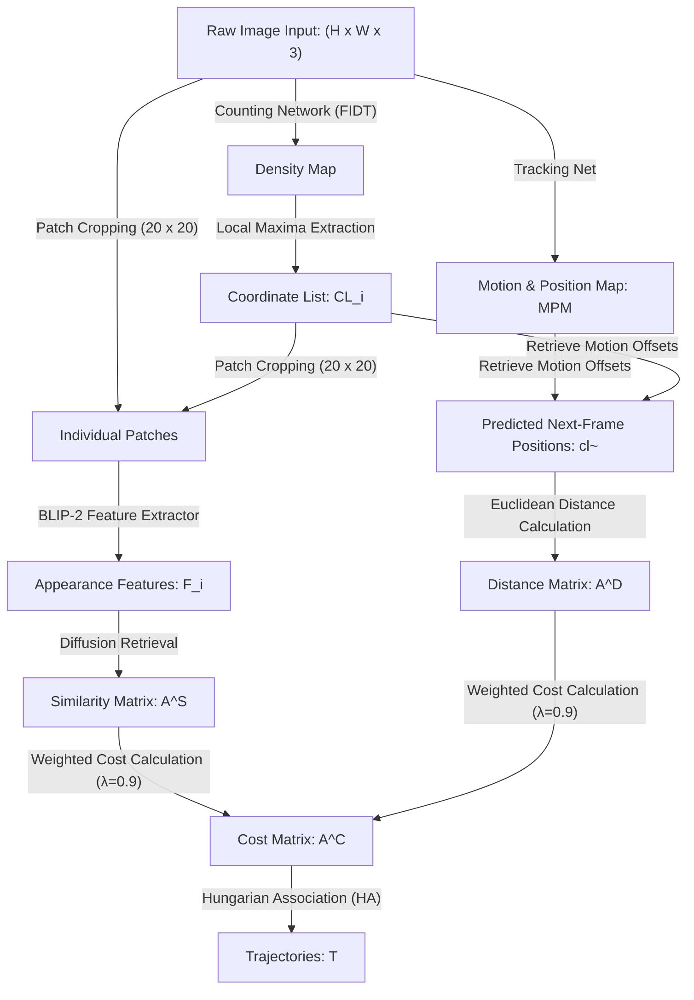

# DenseTrack: Drone-based Crowd Tracking via Density-aware Motion-appearance Synergy

This technical guide offers a structured onboarding reference for research engineers analyzing the DenseTrack framework. It details the underlying mathematical concepts, the engineering architecture, and the specific novel contributions introduced by the authors to solve localization and association challenges in drone-based crowd monitoring.

---

## 1. The 'Big Picture' (Abstract for Beginners)

Multi-Object Tracking (MOT) from aerial drone cameras is vital for crowd monitoring, public safety, and traffic analysis. However, drone footage presents unique challenges: camera distance is high, crowd densities are extreme, and individuals appear as tiny clusters of pixels. 

Under these conditions, standard bounding-box detectors (such as YOLO or Faster R-CNN) fail because targets overlap and lack distinctive visual signatures. Additionally, simple motion-tracking models lose track of targets during rapid vehicle maneuvers.

### The Ground-Grid Analogy
> 🚶 **The Bird's Eye Projection Analogy:**
> Imagine tracking a swarm of ants moving close together from a distance. If you try to draw a box around each ant, they will blur together.
> 
> Instead, you can estimate the density of the swarm to pinpoint where each ant is located (localization). Then, by looking at a tiny cropped photo of each ant and tracking its local movements, you can associate the same ant from frame to frame.

**DenseTrack** implements this tracking-by-counting approach. Instead of directly predicting bounding boxes, it maps crowd density using a specialized counting network to find exact coordinates. It then extracts semantic visual features for each individual using a visual-language pre-training model (BLIP-2) and combines this with local motion maps. By joining appearance and motion metrics, the system maintains accurate trajectories under severe occlusion.

---

## 2. Core Concepts: The Glossary

| Term | Simple Definition | Why it matters in this context |
| :--- | :--- | :--- |
| **Multi-Object Tracking (MOT)** | Identifying and tracking multiple individual targets across video frames. | Formulates the core task of tracking crowd movements. |
| **Crowd Localization** | Identifying the precise coordinates ($x, y$) of every individual in a frame. | Replaces bounding-box detectors which fail in dense aerial crowds. |
| **Focal Inverse Distance Transform (FIDT)** | A density representation that converts coordinates to sharp peaks. | Provides the precise coordinate anchors needed for extraction. |
| **BLIP-2** | A pre-trained visual-language feature extraction model. | Encodes very small visual crops (20x20 pixels) into highly distinct appearance vectors. |
| **Motion and Position Map (MPM)** | A spatial offset map showing coordinate displacements between frames. | Corrects localization discrepancies by tracking the inter-frame velocity. |
| **Hungarian Algorithm** | A bipartite matching optimizer that resolves associations. | Associates frame-to-frame coordinates to produce continuous trajectories. |

---

## 3. How It Works (The 'Under the Hood' Breakdown)

### Data Transformation Pipeline (Tensor Flow Chart)
This diagram illustrates the step-by-step tensor conversions as consecutive camera frames progress through the system:

---

> ### 💡 Core Innovation: Density-Appearance Integration via Frozen VLMs
> Standard crowd counting algorithms produce density maps but discard individual visual details. DenseTrack solves this by cropping localized regions (20x20 pixels) around density peaks and passing them to a frozen Visual-Language Model (BLIP-2). Because BLIP-2 is pre-trained on massive image-text datasets, it can differentiate between similar-looking targets at extremely small resolutions.

---

## 4. Technical Architecture

The technical implementation is divided into three key blocks:

### 1. Counting-for-Localization Network
* **Model:** High-Resolution Network (HRNet) modified to predict density maps.
* **Labeling:** Trained using the Focal Inverse Distance Transform (FIDT) loss function to enforce distinct coordinate centers.
* **Extraction:** Local Maxima (LM) coordinates represent the ground truth points.

### 2. Individual Representation (IR) Pipeline
* **Appearance Branch:** Crops 20x20 patches around coordinate anchors and feeds them into the frozen feature extraction (BE) module of **BLIP-2** to output appearance representations $F_i$ flattened to a vector shape of $(1, W \times H)$.
* **Motion Branch:** The Tracking Net (TN) outputs a Motion and Position Map (MPM) $\tilde{C}_{i,i+1}$ representing motion offset vectors $\tilde{o}$ between consecutive frames.

### 3. Object Association and Tracking (OAT)
* **Similarity Fusion:** Combines the visual similarity matrix $A^S$ (via diffusion retrieval) and the Euclidean distance matrix $A^D$ (via motion prediction) into a unified cost matrix $A^C$:
  $$A^C_{i,i+1} = (-\lambda)\hat{A}^D_{i,i+1} + (1-\lambda)A^S_{i,i+1}$$
* **Optimization:** Solves the bipartite matches using the Hungarian algorithm (HA).

### Module Input / Output Architecture Reference

| Module / Layer | Inputs | Core Operation | Outputs | Tensor Dimensions |
| :--- | :--- | :--- | :--- | :--- |
| **Counting Network (CN)** | Raw image frame | Density map regression using HRNet with FIDT | Density map | $H \times W$ |
| **Local Maxima Extractor** | Density map | Local peak thresholding | Coordinate lists | $N \times 2$ |
| **Appearance Branch** | Raw frame & Coordinate list | Patch cropping and BLIP-2 visual feature encoding | Flattened visual embeddings | $N \times D$ |
| **Tracking Network (TN)** | Frame $t$ and $t+1$ | Motion and Position Map (MPM) offset mapping | Planar motion offsets | $H \times W \times 2$ |
| **Association Block** | Embeddings & Offset metrics | Diffusion feature comparison & Euclidean distance metrics | Cost matrix $A^C$ | $N_{t} \times N_{t+1}$ |
| **Trajectories Update** | Cost matrix $A^C$ | Hungarian algorithm matching | Updated trajectory IDs | Trajectories ($T$) |

---

## 5. Summary of Experimental Results

DenseTrack was evaluated on the **DroneCrowd** benchmark against traditional Multi-Object Tracking (MOT) and Drone-based Crowd Tracking (DCT) architectures.

* **Dataset:** DroneCrowd (112 video clips, 142 sequences of 300 frames, 20,800 annotated trajectories).
* **Metrics:** Temporal Mean Average Precision (**T-mAP**) and localization errors (Mean Absolute Error **MAE** / Root Mean Squared Error **RMSE**).

### Performance Table

| Method | Venue | MOT | DCT | T-mAP | T-AP@0.10 | T-AP@0.15 | T-AP@0.20 |
| :--- | :--- | :--- | :--- | :--- | :--- | :--- | :--- |
| **MCNN** | CVPR'16 | ◯ | ● | 9.16% | 11.47% | 9.65% | 6.36% |
| **DM-Count** | NeurIPS'20 | ◯ | ● | 17.01% | 22.38% | 18.34% | 10.29% |
| **STNNet** | CVPR'21 | ● | ● | 32.50% | 35.45% | 33.99% | 28.05% |
| **BoT-SORT** | arXiv'23 | ● | ◯ | 13.60% | 14.60% | 13.63% | 12.58% |
| **OC-SORT** | CVPR'23 | ● | ◯ | 34.26% | 38.30% | 34.25% | 30.22% |
| **DenseTrack (Ours)** | **ACM MM'24** | ● | ● | **39.44%** | **47.48%** | **39.88%** | **30.95%** |

### The 'Bottom Line'
**The experiment was highly successful.** DenseTrack achieved state-of-the-art tracking metrics, improving the T-mAP score over the previous crowd-tracking model (STNNet) by **6.94%** (absolute change from 32.50% to 39.44%). When incorporating tracking-enhanced feedback, the localization MAE fell from **59.2 down to 19.2** (a **67.5% reduction in error**), showing that tracking loops improve static localization in crowd scenes.

---

## 6. Why This Matters (Impact Analysis)

* **Surveillance and Traffic Systems:** Drones are widely used in modern city management but struggle to isolate individuals in crowded areas. DenseTrack demonstrates that small visual representations (20x20 pixels) extracted by pre-trained VLMs are discriminative enough to track pedestrian flows without expensive target detectors.
* **Onboarding Project Step:**
  As a starting task, install the Salesforce **LAVIS** interface (`pip install salesforce-lavis`). Load the frozen **BLIP-2** feature extractor and pass cropped image patches of pedestrians from a public video. Output and visualize the cosine similarities between different targets to analyze the model's discriminative properties.

---

## 7. Learning Path: How to Replicate

To reproduce or extend this work, study these foundational modules:
1. **Focal Crowd Counting & FIDT:** Study how localization density maps are trained using Inverse Distance Transforms to yield coordinate peaks.
2. **Visual-Language Embedding Spaces:** Learn how frozen Vision Transformers (ViT) from CLIP or BLIP-2 project visual inputs into semantic vector manifolds.
3. **Bipartite Linear Assignments:** Study linear sum assignment cost functions and optimization using the Hungarian algorithm in tracking systems.

---

## 8. Where It Falls Short (Limitations)

* **Degradation in Low Light:** DenseTrack exhibits lower tracking precision under nighttime or heavy cloud cover conditions, where visual features from BLIP-2 lose discriminative clarity.
* **Strict Localization Dependency:** The framework relies entirely on the initial density map coordinates. If the counting network fails to register a target's local maximum, the crop is missed, breaking the trajectory.
* **High-Density Ambiguity:** In highly congested crowds where spatial distance between individuals is less than 15 pixels, Euclidean tracking calculations can mismatch adjacent targets.

---

## Quick Reference: Key Terms

* **MOT:** Multi-Object Tracking
* **FIDT:** Focal Inverse Distance Transform density representation
* **MPM:** Motion and Position Map
* **BLIP-2:** Vision-language model backend used for visual patch feature extraction
* **T-mAP:** Temporal Mean Average Precision tracking metric
* **HA:** Hungarian Algorithm bipartite matching optimizer

---
*Developed and certified by **Arisudan**.*
