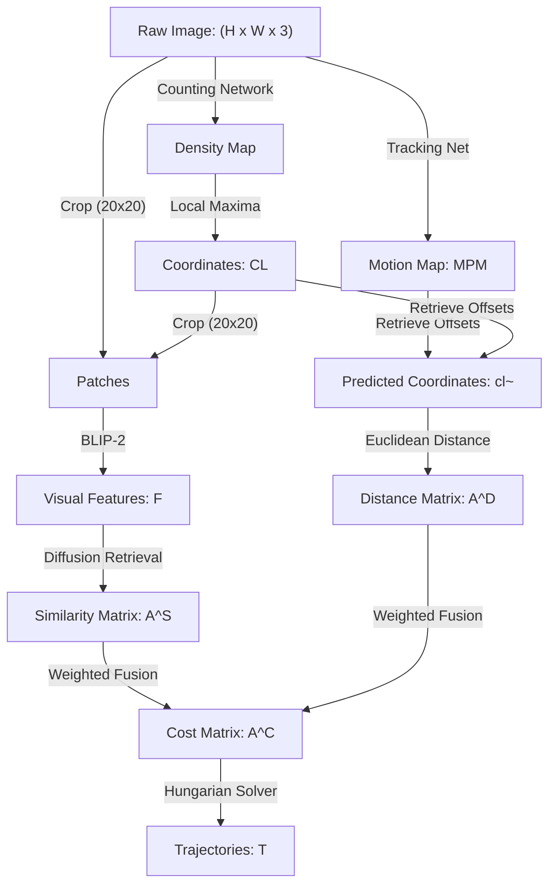

# DenseTrack: Drone-based Crowd Tracking via Density-aware Motion-appearance Synergy

A concise reference guide to understanding how drone cameras track crowded individuals.

---

## 1. Abstract

Drone-based crowd tracking is difficult because pedestrians look very small from high altitudes and cluster closely together. Standard box detectors (like YOLO) fail due to overlap and blurred details.

> [!NOTE]
> ### 🚶 The Ant-Swarm Analogy
> Instead of drawing individual boxes around a dense swarm of moving ants (which leads to overlapping boxes), you first estimate the density of the swarm to locate each ant's center point. Then, you track each ant's local motion and appearance step-by-step.

> [!IMPORTANT]
> ### What DenseTrack Accomplishes
> 1. **Localization:** Predicts crowd density maps to find individual coordinates ($x, y$).
> 2. **Appearance:** Crops small patches (20x20 pixels) around coordinates and extracts visual features using a pre-trained AI model (BLIP-2).
> 3. **Motion:** Predicts target movement using a Tracking Network.
> 4. **Matching:** Merges motion and appearance to track people across frames.

---

## 2. Core Concepts: The Glossary

| Term | Simple Definition | Why it matters |
| :--- | :--- | :--- |
| **MOT** | Multi-Object Tracking | Tracking multiple individuals across video frames. |
| **Localization** | Finding coordinates ($x, y$) of targets | Pinpoints small targets where box-detectors fail. |
| **FIDT** | Focal Inverse Distance Transform | Turns coordinates into sharp peaks for precise tracking. |
| **BLIP-2** | Visual-Language Model | Extracts distinct features from tiny 20x20 visual patches. |
| **MPM** | Motion and Position Map | Models how fast and in what direction individuals move. |
| **Hungarian Alg.** | Bipartite matching solver | Pairs coordinates between frames to build trajectories. |

---

## 3. How it Works

### Data Pipeline (Tensor Flow Chart)

---

> [!IMPORTANT]
> ### 💡 Core Innovation: Self-Supervised VLM Feature Crops
> Instead of training a custom visual detector for tiny objects, DenseTrack crops small 20x20 pixel patches around density coordinates and runs them through a frozen, pre-trained visual-language model (BLIP-2). This extracts rich, pre-learned descriptors that can distinguish individuals even at extreme distances.

---

## 4. Technical Architecture

### Module Input / Output Reference

| Module | Inputs | Core Operation | Outputs | Tensor Shapes |
| :--- | :--- | :--- | :--- | :--- |
| **Counting Net** | Raw image | Density map estimation using HRNet with FIDT | Density map | $H \times W$ |
| **Local Maxima** | Density map | Target peak thresholding | Point coordinates | $N \times 2$ |
| **Appearance Br.** | Image & Coordinates | 20x20 patch cropping and BLIP-2 encoding | Visual embedding vectors | $N \times D$ |
| **Tracking Net** | Frame $t$ and $t+1$ | Motion and Position Map (MPM) offset mapping | 2D motion vectors | $H \times W \times 2$ |
| **Association** | Embeddings & Offsets | Diffusion similarity + Euclidean distance | Cost matrix $A^C$ | $N_{t} \times N_{t+1}$ |
| **Matcher** | Cost matrix $A^C$ | Assignment optimization using Hungarian algorithm | Trajectory paths | Trajectories ($T$) |

---

## 5. Summary of Experimental Results

Tested on the **DroneCrowd** dataset (sunny, cloudy, nighttime urban trajectories).

### Performance Table

| Method | Venue | T-mAP | T-AP@0.10 | T-AP@0.15 | T-AP@0.20 |
| :--- | :--- | :--- | :--- | :--- | :--- |
| **MCNN** | CVPR'16 | 9.16% | 11.47% | 9.65% | 6.36% |
| **DM-Count** | NeurIPS'20 | 17.01% | 22.38% | 18.34% | 10.29% |
| **STNNet** | CVPR'21 | 32.50% | 35.45% | 33.99% | 28.05% |
| **OC-SORT** | CVPR'23 | 34.26% | 38.30% | 34.25% | 30.22% |
| **DenseTrack (Ours)** | **ACM MM'24** | **39.44%** | **47.48%** | **39.88%** | **30.95%** |

---

> [!TIP]
> ### 📊 The 'Bottom Line' Trajectory Gains
> **Highly Successful.** DenseTrack improves tracking T-mAP by **6.94%** (absolute change from 32.50% to 39.44%) compared to previous state-of-the-art crowd tracking models (STNNet). It also reduces tracking localization errors by **67.5%**, dropping Mean Absolute Error (MAE) from **59.2 down to 19.2**.

---

## 6. Why This Matters (Impact Analysis)

* **Real-World Impact:** Allows traffic and safety agencies to track pedestrians in real-time using cheap drone feeds instead of expensive visual detection pipelines.
* **First Step:** Install Salesforce's **LAVIS** interface and test the frozen **BLIP-2** feature extractor on small cropped pedestrian images from any public dataset.

---

## 7. Learning Path: How to Replicate

1. **Density Maps:** Learn to train crowd counters using Focal Inverse Distance Transforms (FIDT).
2. **Visual Transformers:** Study frozen Vision Transformer (ViT) feature extraction pipelines.
3. **Hungarian Matching:** Learn to code linear assignment algorithms for coordinate linking.

---

## 8. Where It Falls Short (Limitations)

> [!WARNING]
> ### ⚠️ Key Technical Limitations
> * **Low-Light / Nighttime:** Contrast drops reduce the discriminative power of BLIP-2 embeddings.
> * **Counting Errors:** Failed density peaks lead to missed crops and broken trajectory links.
> * **High Congestion:** Coordinates closer than 15 pixels can get confused during distance matching.

---

## Quick Reference: Key Terms

* **MOT:** Multi-Object Tracking
* **FIDT:** Focal Inverse Distance Transform
* **MPM:** Motion and Position Map
* **BLIP-2:** Pre-trained Vision-Language Model
* **T-mAP:** Temporal Mean Average Precision
* **HA:** Hungarian Algorithm match optimizer

---

  

