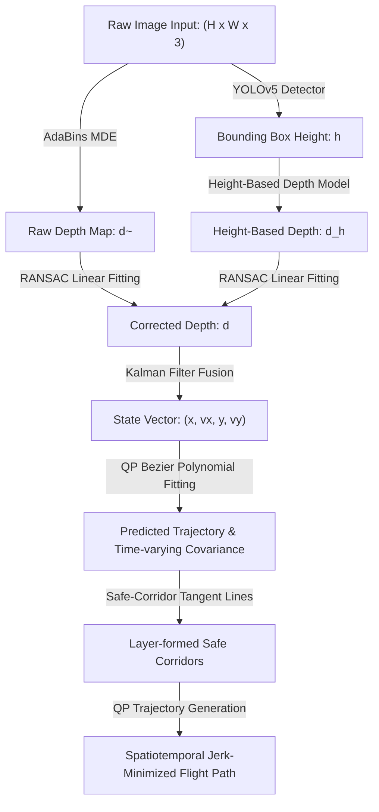

# Dynamic Obstacle Avoidance for an MAV Using Optimization-Based Trajectory Prediction With a Monocular Camera

A concise reference guide to understanding how micro-air vehicles (MAVs) avoid moving obstacles using a single camera.

---

## 1. Abstract

Micro-air vehicles (MAVs) have strict weight limitations, which makes lightweight monocular cameras ideal for navigation. However, tracking and avoiding moving obstacles with a single camera is difficult due to **scale ambiguity** (the camera cannot determine absolute distance). 

This paper proposes an integrated monocular avoidance framework. It estimates metric depth by scaling deep-learning-based depth maps using a height-based reference. It then tracks target coordinates using a Kalman filter, predicts future obstacle trajectories with Bezier curve optimization, and generates smooth, collision-free spatiotemporal flight paths inside "safe corridors."

> [!NOTE]
> ### 🚶 The Ground-Grid Analogy
> Imagine flying a drone through a forest while blind in one eye (monocular view). You see a person walking, but you cannot determine their distance. 
> 
> However, if you know the typical height of a human, you can compare their height on your video feed to estimate distance. By drawing an expanding bubble of uncertainty around their predicted walking path, you can map out a curved, safe tunnel (corridor) to fly through without colliding.

> [!IMPORTANT]
> ### What the Avoidance System Accomplishes
> 1. **Scale-Corrected Depth:** Uses YOLOv5 bounding boxes to calculate target distance, calibrating deep-learning depth maps (AdaBins) via RANSAC.
> 2. **State Tracking:** Fuses position and velocity measurements using a Kalman filter.
> 3. **Uncertainty Trajectory Prediction:** Fits dynamic positions to Bezier curves using Quadratic Programming (QP) to generate expanding covariance ellipses.
> 4. **Flight Path Generation:** Plans smooth, jerk-minimized trajectories within dynamic safe corridors.

---

## 2. Core Concepts: The Glossary

| Term | Simple Definition | Why it matters |
| :--- | :--- | :--- |
| **MAV** | Micro Air Vehicle | Small drones with strict payload, battery, and computing constraints. |
| **MDE** | Monocular Depth Estimation | Guessing depth information using a single 2D camera feed. |
| **Scale Ambiguity** | Lost metric scale in 2D image projections | Prevents a single camera from determining absolute distance. |
| **RANSAC** | Random Sample Consensus | Fits mathematical lines to data while ignoring outlier noise. |
| **Bezier Curve** | A parametric curve defined by control points | Generates smooth, continuous paths for prediction and flight. |
| **Safe Corridor** | A space-time boundary enclosing collision-free zones | Defines the legal boundaries for trajectory optimization. |
| **QP** | Quadratic Programming | An optimization method solving quadratic goals with linear constraints. |

---

## 3. How it Works

### Data Pipeline (Tensor Flow Chart)

---

> [!IMPORTANT]
> ### 💡 Core Innovation: Scale-Corrected MDE Fusion
> Instead of relying on heavy stereo cameras or short-range RGB-D sensors, the authors corrected the scale ambiguity of a deep Monocular Depth Estimation network (AdaBins) by coupling it with a height-based depth formula. By using YOLOv5 to detect known objects (like humans) and calculating distance from their bounding-box height, they scale-calibrate the depth map in real-time.

---

## 4. Technical Architecture

### Module Input / Output Reference

| Module | Inputs | Core Operation | Outputs | Tensor Shapes |
| :--- | :--- | :--- | :--- | :--- |
| **YOLOv5 Detector** | RGB Camera frame | Object detection & bounding box scaling | Target bounding box height ($h$) | $1 \times 1$ |
| **AdaBins MDE** | RGB Camera frame | Dense depth map estimation using CNN & Transformer | Raw relative depth map ($\hat{d}$) | $H \times W$ |
| **RANSAC Calibrator** | Bounding box $h$ & Depth $\hat{d}$ | Linear regression fitting: $d = \alpha \hat{d} + \beta$ | Calibrated metric depth map ($d$) | $H \times W$ |
| **Kalman Filter** | Metric depth map | State tracking estimation | Position & velocity vectors ($\mathbf{x}$) | $4 \times 1$ |
| **Bezier Predictor** | State vectors ($\mathbf{x}$) | Bernstein polynomial curve fitting via OSQP solver | Covariance ellipses (uncertainty matrix $R(t)$) | $2 \times 2$ |
| **Flight Path Planner** | Safe Corridors & Goal ($P_g$) | Jerk minimization ($d^3x/dt^3$) using QP solver | Smooth flight control waypoints | $3 \times 1$ |

---

## 5. Summary of Experimental Results

Tested in Gazebo simulations and physical lawns using an 80g **DJI Tello** drone tracking walking pedestrians at 1 m/s.

### Performance Table

| Metric | Constant Velocity Model (CVM) | DroNet [15] (Learning-based Steering) | Ego-Planner [26] (Gradient-based) | **Ours (Zhou & Lee)** |
| :--- | :--- | :--- | :--- | :--- |
| **Prediction Error (m)** | 1.61 | - | - | **1.19** |
| **Uncertainty Efficiency (URE)** | 2.09 | - | - | **4.85** |
| **Flight Time (s)** | - | 47 s | Crashed (fast obstacles) | **28 s** |
| **Collision Rate (fast targets)** | High | Collision | Collision | **0% (Safe)** |

---

> [!TIP]
> ### 📊 The 'Bottom Line' Avoidance Performance
> **Highly Successful.** The proposed method reduced trajectory prediction errors by **26%** (from 1.61m down to 1.19m) compared to standard CVM trackers. In physical flight tests, it cut drone detour times by **40%** (from 47s down to 28s) while successfully avoiding collisions that caused baseline planners to crash.

---

## 6. Why This Matters (Impact Analysis)

* **Real-World Impact:** Allows lightweight micro-drones to fly autonomously through forests or cluttered workspaces using a cheap $10 camera instead of heavy, power-hungry LiDAR arrays.
* **First Step:** Implement a simple Python script using a pre-trained YOLOv5 network to detect humans in a camera stream. Calculate distance ($d$) using the formula $d = (H/h)*f$ where $H=1.7$ meters (average human height), $h$ is bounding-box pixels, and $f$ is camera focal length.

---

## 7. Learning Path: How to Replicate

1. **RANSAC Calibration:** Learn how to use RANSAC regression to scale relative model outputs to physical metric units.
2. **Bernstein Polynomials:** Study Bezier curves, control points, and convex hull constraints for smooth trajectory modeling.
3. **OSQP Solvers:** Learn to formulate path planning as a Quadratic Programming (QP) optimization problem solved by OSQP.

---

## 8. Where It Falls Short (Limitations)

> [!WARNING]
> ### ⚠️ Key Technical Limitations
> * **Prior Height Constraint:** Scale correction requires knowing the approximate physical height of the target beforehand. If height varies or is unknown, distance estimation fails.
> * **Planar Motion Model:** The trajectory prediction and safe corridors are restricted to a 2D horizontal plane, which cannot handle environments with severe vertical slope changes.
> * **Laptop Offloading:** Computing (YOLO, AdaBins, OSQP trajectory generation) is processed on an external laptop via Wi-Fi; it does not run entirely onboard the drone.

---

## Quick Reference: Key Terms

* **MAV:** Micro Air Vehicle
* **MDE:** Monocular Depth Estimation
* **CVM:** Constant Velocity Model
* **QP:** Quadratic Programming
* **URE:** Uncertainty Range Efficiency
* **RAST:** Risk-Aware Spatiotemporal trajectory generation

---

  

