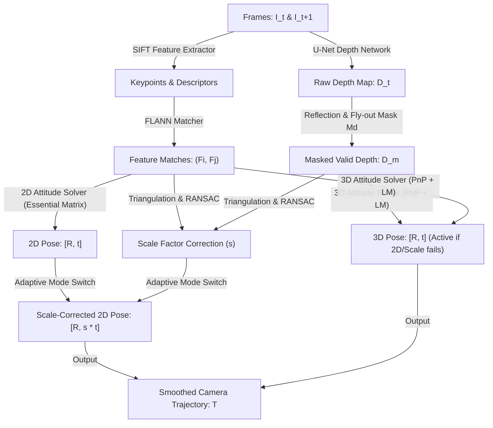

# GD-MVO: Monocular Geometric Visual Odometry Using Image Depth Prediction

A concise reference guide evaluating a hybrid monocular visual odometry system that fuses geometric feature matching with deep self-supervised depth prediction.

---

## 1. Abstract

Traditional geometric visual odometers estimate camera trajectories by tracking feature points, but they struggle in low-texture and highly dynamic urban environments. While deep learning models bypass feature matching, they lack the overall accuracy of geometric methods. 

**GD-MVO** addresses this by introducing a hybrid visual odometry framework. It integrates SIFT feature extraction and FLANN matching with a self-supervised U-Net depth prediction network. To handle dynamic obstacle noise, it employs a dual-solver system (2D and 3D Attitude Solvers) coupled with an adaptive scale factor correction module. A novel fly-out mask is introduced to block edge boundary prediction errors during camera forward motion.

> [!NOTE]
> ### 🚶 The Foggy Road Analogy
> Imagine driving through a foggy city where you can only spot a few distinct signs on the road. A standard navigation system (geometric) tries to match these visual points, but if other cars move around you (dynamic environment), the system gets confused. 
> 
> However, if you have a co-pilot with a high-quality depth scanner (depth network), they can estimate how far away road landmarks are. By dynamically switching between matching 2D road points (2D Solver) and using the scanner's 3D coordinates (3D Solver) while ignoring distorted data at the edge of the windshield (fly-out mask), the vehicle tracks its path with extreme precision.

> [!IMPORTANT]
> ### What GD-MVO Accomplishes
> 1. **Robust Hybrid Estimation:** Combines SIFT + FLANN keypoint matching with U-Net depth maps.
> 2. **Adaptive Dual Solver:** Alternates between a 2D Attitude Solver (using Essential Matrices) and a 3D Attitude Solver (using PnP optimization) depending on scale correction reliability.
> 3. **Fly-out Boundary Masking:** Blocks edge warping artifacts from interfering with depth estimations.
> 4. **Low Scale Drift:** Surpasses existing visual odometry methods on the KITTI benchmark.

---

## 2. Core Concepts: The Glossary

| Term | Simple Definition | Why it matters |
| :--- | :--- | :--- |
| **Visual Odometry (VO)** | Estimating a robot's path trajectory by analyzing successive camera images. | Serves as a core localization module for autonomous systems. |
| **Scale Ambiguity** | Lost metric scale in single-camera projections | Causes monocular visual systems to drift unless scale factors are corrected. |
| **FLANN** | Fast Library for Approximate Nearest Neighbors | A fast search library used to match high-dimensional SIFT feature descriptors. |
| **Fly-out Mask** | A binary boundary filter map | Shields subsequent solvers from low-accuracy depth predictions at warped image edges. |
| **2D Attitude Solver** | Estimates pose from 2D-2D point shifts | Resolves relative rotation and translation up to scale using Essential Matrices. |
| **3D Attitude Solver** | Estimates pose from 3D-2D point pairs | Resolves absolute rotation and translation by solving the PnP problem. |
| **Photometric Loss** | Reconstructed image similarity error | Trains depth networks without ground truth depth labels. |

---

## 3. How it Works

### Data Pipeline (Tensor Flow Chart)

---

> [!IMPORTANT]
> ### 💡 Core Innovation: Dual-Solver Mode Switching
> To survive highly dynamic environments (like urban traffic), the system does not rely on a single solver logic. If the scale factor correction module operates optimally, the 2D Attitude Solver tracks the camera trajectory. However, if dynamic obstacle movement disrupts the scale module, GD-MVO seamlessly transitions to the 3D Attitude Solver (PnP + local nonlinear Levenberg-Marquardt optimization), preserving track stability.

---

## 4. Technical Architecture

### Module Input / Output Reference

| Module | Inputs | Core Operation | Outputs | Tensor / Data Shapes |
| :--- | :--- | :--- | :--- | :--- |
| **SIFT Extractor** | Image frames | Scale-space octave feature extraction | Keypoint descriptors | $N \times 128$ |
| **FLANN Matcher** | Descriptors ($F_i, F_j$) | K-D tree approximate nearest neighbor search | Feature matches | Matches |
| **Depth Network** | RGB camera frame | Self-supervised depth map prediction via U-Net | Raw relative depth map ($D$) | $640 \times 192$ |
| **Fly-out Mask** | Inter-frame motion $T$ & Depth | Reflection boundary padding & edge filtering | Masked valid depth map ($D_m$) | $640 \times 192$ |
| **Scale Corrector** | Matches & Depth map | Triangulation ratios & RANSAC model fitting | Scale factor ($s$) | Scalar |
| **2D Solver** | Matches | Essential Matrix estimation & Singular Value Decomposition | Pose up to scale ($[R, t]$) | $3 \times 3, 3 \times 1$ |
| **3D Solver** | Matches & Depth map ($D_m$) | 3D back-projection & Levenberg-Marquardt PnP optimization | Absolute camera pose ($[R, t]$) | $3 \times 3, 3 \times 1$ |

---

## 5. Summary of Experimental Results

Tested on the **KITTI** visual odometry dataset, **Malaga Urban Dataset** (36 km trajectory), and a simulated **Lunar Dataset** (Webots moon terrain).

### Performance Table (KITTI Sequences 00-10 Average)

| Method | Type | Average Translation Error ($t_{err}$ %) | Average Rotation Error ($r_{err}$ °/100m) | RPE (m) (↓) |
| :--- | :--- | :--- | :--- | :--- |
| **ORB-SLAM2** [6] | Geometry | 11.878% | 0.284° | 0.482m |
| **Depth-VO-Feat** [12] | End-to-End DL | 111.90% | 3.115° | 0.148m |
| **TSformer-VO** [14] | Transformer DL | 12.938% | 4.349° | 0.164m |
| **DF-VO** [18] | Hybrid Flow/Depth | 6.747% | 1.597° | 0.138m |
| **RAUM-VO** [20] | Hybrid SuperPoint | 3.676% | 0.846° | 0.067m |
| **GD-MVO (Ours)** | **Hybrid Dual-Solver** | **1.778%** | **0.359°** | **0.045m** |

---

> [!TIP]
> ### 📊 The 'Bottom Line' Trajectory Gains
> **Highly Successful.** GD-MVO achieved a benchmark translation error of **1.778%** on the KITTI dataset, representing a **51.6% accuracy improvement** over the hybrid RAUM-VO baseline. Ablation testing proved that without the scale factor correction module, translation errors crashed to **~55%**, confirming the module's critical role in stabilizing monocular paths.

---

## 6. Why This Matters (Impact Analysis)

* **Real-World Impact:** Dynamic urban obstacles (like passing vehicles) disrupt standard geometric visual odometry. GD-MVO's dual-solver framework dynamically shifts planning logic to preserve localization, allowing autonomous vehicles to safely navigate high-traffic streets using only a low-cost front camera.
* **First Step:** Implement SIFT feature point extraction on a sequence of images in Python using OpenCV (`cv2.SIFT_create()`). Match keypoints using the Fast Library for Approximate Nearest Neighbors matcher (`cv2.FlannBasedMatcher`) and visualize the matching lines.

---

## 7. Learning Path: How to Replicate

1. **Local Feature Descriptors:** Study SIFT keypoint extraction and K-D tree-based FLANN matching.
2. **Self-Supervised Warping Loss:** Learn how photometric reconstruction loss and SSIM constraints train monocular depth networks without LiDAR labels.
3. **PnP Trajectory Optimization:** Study how 3D-to-2D correspondence networks solve the Perspective-n-Point problem using Levenberg-Marquardt optimization.

---

## 8. Where It Falls Short (Limitations)

> [!WARNING]
> ### ⚠️ Key Technical Limitations
> * **Border Information Loss:** The fly-out mask ignores image borders to filter out edge projection artifacts. This discards potential features and reduces the effective field of view.
> * **Repetitive Low-Texture Failures:** On simulated lunar environments with few textures, SIFT features struggle to distinguish repetitive structures, leading to rotational tracking drift.
> * **Pure Rotational Degeneracy:** The scale factor correction module degrades under purely rotational motions, causing scale estimation tracking to fail.

---

## Quick Reference: Key Terms

* **MVO:** Monocular Visual Odometry
* **FLANN:** Fast Library for Approximate Nearest Neighbors
* **PnP:** Perspective-n-Point pose optimization
* **SSIM:** Structural Similarity Index Measure
* **RPE:** Relative Position Error
* **LM:** Levenberg-Marquardt optimization algorithm

---

  

