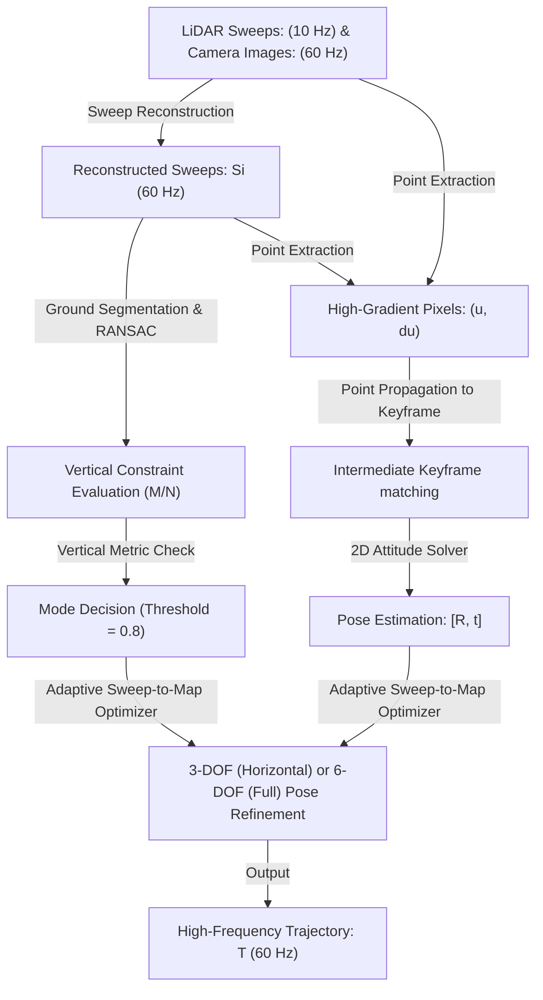

# SDV-LOAM: Semi-Direct Visual–LiDAR Odometry and Mapping

A concise reference guide evaluating SDV-LOAM, a tightly integrated visual-LiDAR odometry system featuring semi-direct image alignment, adaptive degrees of freedom (DOF) optimization, and high-frequency sweep reconstruction.

---

## 1. Abstract

Visual-LiDAR fusion frameworks (V-LOAM) offer a robust solution for localization and mapping. However, standard methods suffer from two key issues: 3D-2D depth association errors when projecting sparse points onto 2D image features, and vertical trajectory drift during 6-DOF optimization on flat ground surfaces.

**SDV-LOAM** solves these challenges by combining a **semi-direct visual odometry** module with an **adaptive LiDAR sweep-to-map optimizer**. The visual module directly extracts high-gradient pixels where 3D LiDAR points project onto the image, avoiding interpolation errors. To handle flat terrains, the system dynamically switches between 3-DOF (horizontal) and 6-DOF (full spatial) optimization based on the richness of vertical constraints. Additionally, a sweep reconstruction technique aligns the 10 Hz LiDAR data with 60 Hz camera frames to output high-frequency poses.

> [!NOTE]
> ### 🚶 The Forklift Warehouse Analogy
> Imagine driving a forklift through a massive warehouse. The vehicle has a front camera (fast but lacks depth accuracy) and a spinning laser scanner (slow but highly accurate at measuring depth). 
> 
> Traditional systems try to map single laser lines to tiny visual landmarks, causing alignment errors. Instead, SDV-LOAM projects the laser points directly onto high-contrast edges in the camera view (semi-direct VO). To prevent the forklift from drifting up or down when driving on a flat concrete floor, the system adaptively disables vertical adjustments (3-DOF mode) when it detects a flat ground plane.

> [!IMPORTANT]
> ### What SDV-LOAM Accomplishes
> 1. **Direct Depth Projection:** Avoids 3D-2D interpolation errors by projecting LiDAR points onto high-gradient image pixels.
> 2. **Adaptive Optimization Constraints:** Automatically switches between 3-DOF and 6-DOF modes depending on vertical geometry.
> 3. **Sweep Reconstruction:** Upsamples LiDAR output from 10 Hz to 60 Hz to match camera capture speeds.
> 4. **Low Drift Benchmark:** Achieves a translational drift of **0.60%** on the KITTI test benchmark.

---

## 2. Core Concepts: The Glossary

| Term | Simple Definition | Why it matters |
| :--- | :--- | :--- |
| **V-LOAM** | Visual-LiDAR Odometry and Mapping | Sensor fusion combining cameras and LiDAR to estimate trajectories and build maps. |
| **Semi-Direct VO** | Hybrid visual odometry | Fuses direct photometric alignment (for speed) with feature re-projection (for accuracy). |
| **Depth Association Error** | Interpolation mismatches between 2D and 3D data | Introduces tracking drift when visual features fail to align with sparse laser points. |
| **Sweep Reconstruction** | Overlapping laser packet regrouping | Interpolates low-frequency 3D scans to match high-frequency camera frame rates. |
| **3-DOF vs. 6-DOF** | Constrained vs. Full spatial optimization | Disabling vertical degrees of freedom (roll, pitch, z) prevents drift on flat roads. |
| **Intermediate Keyframe** | A temporary visual bridge frame | Reduces scale and perspective differences during pixel-matching intervals. |
| **ICP** | Iterative Closest Point | Geometric algorithm matching consecutive 3D scans to map environments. |

---

## 3. How it Works

### Data Pipeline (Tensor Flow Chart)

---

> [!IMPORTANT]
> ### 💡 Core Innovation: Adaptive DOF Selection
> Standard LiDAR odometry systems perform full 6-DOF pose updates on every scan. However, when driving on flat, open roads, the vertical constraints are extremely weak (since the ground is the only planar surface). Optimizing roll, pitch, and upward translation in these conditions causes the path to drift vertically. SDV-LOAM calculates the ratio of ground-to-vertical points ($M/N$). If this ratio exceeds 0.8, it locks the vertical variables and optimizes only the 3 horizontal DOFs, preserving trajectory stability.

---

## 4. Technical Architecture

### Module Input / Output Reference

| Module | Inputs | Core Operation | Outputs | Tensor / Data Shapes |
| :--- | :--- | :--- | :--- | :--- |
| **Camera Sensor** | Visual environment | High-speed image capture | Grayscale frames | $1280 \times 1040$ (60 Hz) |
| **LiDAR Sensor** | Laser reflections | 360-degree point cloud sweep | Sparse point cloud | $10 \text{ Hz scan}$ |
| **Sweep Reconstructor** | Raw point clouds & camera frames | Overlapping temporal packet integration | Reconstructed sweeps ($S_i$) | $60 \text{ Hz sweeps}$ |
| **Point Pre-processor** | Sweeps ($S_i$) | Ground plane segmentation via RANSAC | Ground ratio $M/N$ | Scalar |
| **Point Extractor** | Frame & Reconstructed sweep | Grid-based high-gradient pixel matching | Visual depth points ($P_{k_n}$) | $N \times 3$ |
| **2D Solver** | Keyframe matches | Essential matrix estimation & SVD | Relative camera pose | $3 \times 3, 3 \times 1$ |
| **LiDAR Optimizer** | Matches & Sweep ($S_i$) | Point-to-plane ICP (3-DOF or 6-DOF mode) | Refined trajectory coordinates | $3 \times 3, 3 \times 1$ |

---

## 5. Summary of Experimental Results

Tested on the **KITTI** benchmark, **KITTI-360**, **KITTI-CARLA** (simulation), and a custom vehicle platform (FLIR camera + Velodyne VLP-16).

### Performance Table (KITTI Odometry Benchmark)

| Method | Sensor Configuration | Output Pose Frequency | KITTI Training Avg RTE (%) (↓) | KITTI Test Benchmark RTE (%) (↓) |
| :--- | :--- | :--- | :--- | :--- |
| **DEMO** [12] | Visual-LiDAR (Loosely) | Camera Rate | - | 1.16% (VO only) |
| **A-LOAM** | LiDAR-only | 10 Hz | 1.56% | - |
| **Fast-LOAM** [11] | LiDAR-only | 10 Hz | 1.34% | - |
| **CT-ICP** [19] | LiDAR-only | 10 Hz | 0.50% | 0.59% |
| **SDV-LOAM (Ours)** | **Visual-LiDAR (Tightly)** | **Camera Rate (60 Hz)** | **0.47%** | **0.60%** (Ranks 8th) |

---

> [!TIP]
> ### 📊 The 'Bottom Line' Trajectory Gains
> **Highly Successful.** SDV-LOAM achieved a translational drift of **0.60%** on the official KITTI test benchmark, ranking **8th globally** among visual-LiDAR models. Its sweep reconstruction successfully upsampled tracking output frequency from 10 Hz to **60 Hz** in real-time without introducing trajectory inconsistencies.

---

## 6. Why This Matters (Impact Analysis)

* **Real-World Impact:** High-speed autonomous vehicles require low-latency pose estimation to safely execute steering controls. SDV-LOAM bridges the speed gap between high-frequency cameras and low-frequency LiDARs, providing accurate 60 Hz feedback while preventing vertical path drift on flat city roads.
* **First Step:** Collect a LiDAR bag file and a camera feed. Write a Python script using `rospy` to capture the timestamps of both inputs, and implement a queue that pairs each camera image with a reconstructed LiDAR sweep composed of packets received within $\pm 50 \text{ ms}$ of the image timestamp.

---

## 7. Learning Path: How to Replicate

1. **Semi-Direct Visual Tracking:** Study SVO (Forster, 2014) to learn how direct image intensity alignment and keypoint adjustments are implemented.
2. **Point Cloud Ground Segmentation:** Learn how to isolate ground planes from 3D scans using RANSAC line fitting.
3. **Point-to-Plane ICP Optimization:** Study how spatial scans are registered to maps by minimizing orthogonal point distance to local plane normals.

---

## 8. Where It Falls Short (Limitations)

> [!WARNING]
> ### ⚠️ Key Technical Limitations
> * **Low-Texture Failure:** The visual module relies on tracking high-gradient image edges. In featureless scenes (like plain tunnels), the VO fail-safes are triggered, reducing performance.
> * **Sparse LiDAR Scans at High Speed:** If the vehicle travels too fast, the density of the 16-beam Velodyne LiDAR scan degrades, causing ground plane estimation errors.
> * **Closed-Source Baseline Comparisons:** While SDV-LOAM matches the accuracy of top systems, it remains slightly behind the closed-source tightly coupled V-LOAM framework.

---

## Quick Reference: Key Terms

* **V-LOAM:** Visual-LiDAR Odometry and Mapping
* **SVO:** Semi-direct Visual Odometry
* **ICP:** Iterative Closest Point
* **DOF:** Degrees of Freedom
* **RTE:** Relative Translational Error
* **RANSAC:** Random Sample Consensus

---

  

