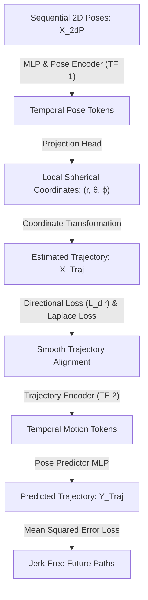

# Unified Human Localization and Trajectory Prediction with Monocular Vision

A concise reference guide evaluating MonoTransmotion (MT), a unified Transformer-based architecture that performs both 3D human localization and trajectory forecasting using a single monocular camera.

---

## 1. Abstract

Conventional human trajectory predictors rely on clean, pre-processed coordinates from active sensors like LiDAR. In real-world robotics, these models fail because they receive noisy input detections from upstream monocular cameras, causing errors to propagate.

**MonoTransmotion (MT)** addresses this limitation by introducing a unified, joint Transformer architecture. It directly estimates a target's Bird's Eye View (BEV) coordinates from sequential 2D pose keypoints and uses this history to forecast future path trajectories. By introducing a novel **directional loss function** ($L_{dir}$) that regularizes the direction of estimated velocities, the model ensures smooth, scale-consistent path forecasting without expensive hardware.

> [!NOTE]
> ### 🚶 The Windshield Keyhole Analogy
> Imagine guiding a blindfolded walker through a busy crowd by looking only through a small keyhole (monocular camera). If you try to guess where people are standing and instantly tell the walker where to step next, your directions will be jerky and cause a collision. 
> 
> However, if you track the exact direction and speed of each person (directional loss) and update your predictions based on their historical walking rhythm (unified transformer), your directions become smooth and collision-free.

> [!IMPORTANT]
> ### What MonoTransmotion Accomplishes
> 1. **Joint Estimation Pipeline:** Solves both BEV localization and trajectory prediction inside a single, unified Transformer network.
> 2. **Jerk Minimization:** Regularizes velocity vectors via a custom directional loss ($L_{dir}$) to ensure smooth predicted paths.
> 3. **Curated & Raw Evaluation:** Demonstrates robustness on both autonomous vehicle data (NuScenes) and raw, noisy egocentric video streams (HEADS-UP).
> 4. **No LiDAR Dependency:** Operates entirely on low-cost, monocular cameras.

---

## 2. Core Concepts: The Glossary

| Term | Simple Definition | Why it matters |
| :--- | :--- | :--- |
| **Monocular BEV Localization** | Estimating a person's top-down 3D coordinates ($x, y$) from a single camera feed. | Replaces active LiDAR sensors for low-cost robotic navigation. |
| **Trajectory Prediction** | Forecasting an agent's future positions over a short time horizon. | Enables mobile systems to plan collision-free paths. |
| **Directional Loss ($L_{dir}$)** | A loss function matching estimated and true velocity directions. | Regularizes the trajectory matching to prevent jitter and incorrect yaw directions. |
| **Laplace Loss ($L_{Laplace}$)** | A localization loss modeling depth uncertainty. | Restricts position coordinates based on estimated depth variances. |
| **ADE** | Average Displacement Error | Measures the average distance error (in meters) along the predicted path. |
| **FDE** | Final Displacement Error | Measures the coordinate distance error at the final predicted timestamp. |

---

## 3. How it Works

### Data Pipeline (Tensor Flow Chart)

---

> [!IMPORTANT]
> ### 💡 Core Innovation: Unified Temporal Pre-Training (L → T → LT)
> Training a joint localization-prediction network from scratch usually fails to converge. The prediction module gets confused by the initial random coordinate guesses of the localization module. MonoTransmotion solves this by using a staged training process: the localization module is trained first (L), the prediction module is trained second (T), and both are finally jointly fine-tuned (LT) to preserve path continuity.

---

## 4. Technical Architecture

### Module Input / Output Reference

| Module | Inputs | Core Operation | Outputs | Tensor / Data Shapes |
| :--- | :--- | :--- | :--- | :--- |
| **Keypoint Estimator** | Video frame sequence | 2D keypoint estimation via OpenPifpaf | Sequential 2D poses ($X^{2dP}$) | $T_{obs} \times 17 \times 2$ |
| **Pose Encoder (TF 1)** | 2D poses ($X^{2dP}$) | MLP embedding and Transformer sequence encoding | Temporal pose tokens | $T_{obs} \times D$ |
| **Projection Head** | Pose tokens | Spherical projection & global coordinate conversion | Estimated BEV trajectory ($X^{Traj}$) | $T_{obs} \times 2$ |
| **Trajectory Encoder (TF 2)** | Estimated trajectory ($X^{Traj}$) | Transformer motion feature encoding | Temporal motion tokens | $T_{obs} \times D$ |
| **Pose Predictor** | Motion tokens | Trajectory coordinate regression via MLP | Predicted future BEV path ($Y^{Traj}$) | $T_{pred} \times 2$ |

---

## 5. Summary of Experimental Results

Benchmarked on **NuScenes** (curated autonomous driving dataset) and **HEADS-UP** (non-curated egocentric blind assistance dataset).

### Performance Table

| Model | Dataset | BEV Localization ADE (m) (↓) | Trajectory Prediction ADE (m) (↓) | Trajectory Prediction FDE (m) (↓) |
| :--- | :--- | :--- | :--- | :--- |
| **FCOS3D [4] + ST [2]** | NuScenes | 1.530m | 2.130m | 2.438m |
| **Monoloco [5] + ST [2]** | NuScenes | 1.255m | 1.726m | 2.169m |
| **MonoTransmotion (Ours)** | **NuScenes** | **1.093m** | **1.517m** | **1.931m** |
| **Monoloco [5] + ST [2]** | HEADS-UP | 0.507m | 1.020m | 1.518m |
| **MonoTransmotion (Ours)** | **HEADS-UP** | **0.462m** | **0.958m** | **1.405m** |

---

> [!TIP]
> ### 📊 The 'Bottom Line' Trajectory Gains
> **Highly Successful.** MonoTransmotion improves trajectory prediction accuracy by **12%** (reducing ADE from 1.726m down to 1.517m) compared to the keypoint-based baseline. The pipeline (OpenPifpaf + MT) runs at **11.3 FPS** (82.5 ms per frame) on an NVIDIA RTX 3090, confirming real-time edge viability.

---

## 6. Why This Matters (Impact Analysis)

* **Real-World Impact:** Smart glasses for visually impaired users cannot support heavy sensors like LiDAR. MonoTransmotion tracks pedestrians using only a single cheap camera. Because it utilizes keypoint histories and directional losses, it filters out camera jitter caused by head movement, preventing false collision warnings.
* **First Step:** Run a pre-trained OpenPifpaf keypoint detector on a pedestrian video sequence. Extract the $(x, y)$ coordinates of the nose or shoulder joint over a window of 5 frames, and calculate the velocity vector to measure the trajectory direction.

---

## 7. Learning Path: How to Replicate

1. **Monocular 3D Localization:** Study Monoloco (L. Bertoni, 2019) to learn how 3D coordinates are estimated from 2D joint distributions.
2. **Positional Time Embeddings:** Study how temporal positional variables are injected into Transformer inputs to preserve sequence order.
3. **Staged Neural Training:** Study learning constraints and convergence behaviors when training dependent perception and prediction networks.

---

## 8. Where It Falls Short (Limitations)

> [!WARNING]
> ### ⚠️ Key Technical Limitations
> * **Distance Ambiguity Decay:** Monocular depth estimation error scales up at longer distances (exceeding 20 meters), causing trajectory forecasting to degrade.
> * **Severe Occlusion Vulnerability:** The model relies on visible 2D skeleton joints. If a pedestrian is blocked by an obstacle (like a vehicle), keypoint detection fails, breaking the sequence.
> * **Edge Compute Constraints:** The end-to-end framework requires 82.5 ms of processing time on an RTX 3090 GPU, which exceeds the processing limitations of low-power mobile microcontrollers.

---

## Quick Reference: Key Terms

* **MT:** MonoTransmotion
* **ADE:** Average Displacement Error
* **FDE:** Final Displacement Error
* **ALE:** Average Localization Error
* **ST:** Social-Transmotion
* **TF:** Transformer

---

  

