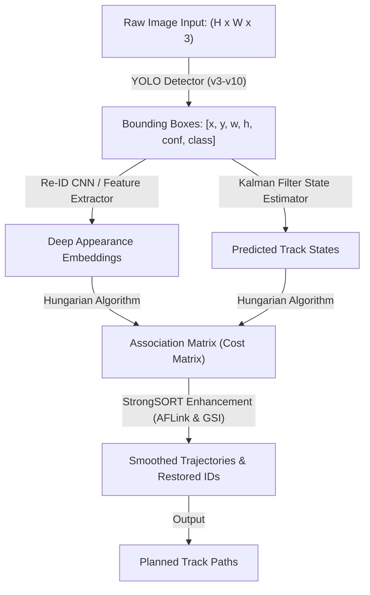

# A Comparative Study of YOLO Series (v3–v10) with DeepSORT and StrongSORT: A Real-Time Tracking Performance Study

A concise reference guide systematically evaluating the integration of lightweight YOLO detectors with DeepSORT and StrongSORT tracking frameworks.

---

## 1. Abstract

Multi-Object Tracking (MOT) is critical for autonomous driving, surveillance, and robotics. However, deploying these pipelines in computationally limited edge-device environments requires balancing speed and tracking precision. 

This paper benchmarks the entire YOLO family (YOLOv3 through YOLOv10) in light-sized and nano-sized versions, integrated with two state-of-the-art trackers: **DeepSORT** and **StrongSORT**. Evaluated on the MOT17 and MOT20 datasets, the study analyzes tracking accuracy, precision, and identity switches. The findings identify **YOLOv5** as the most stable baseline, offering a robust trade-off between speed and trajectory continuity on edge devices.

> [!NOTE]
> ### 🚶 The Subway Spotter Analogy
> Imagine managing a busy subway station using a budget computer. YOLO is the "spotter" that points out people in each frame, and DeepSORT/StrongSORT is the "coordinator" that tracks their movement over time. 
> 
> This paper compares different generations of spotters (v3 to v10) to find the best match for the coordinators. It shows that the newest spotters are not always the best fit, as slight detection fluctuations can confuse the coordinator, leading to lost targets.

> [!IMPORTANT]
> ### What this Comparison Accomplishes
> 1. **Complete Benchmark:** Evaluates eight generations of YOLO detectors (v3-v10) paired with real-time trackers.
> 2. **Edge Hardware Focus:** Assesses lightweight models tailored for low-computing hardware constraints.
> 3. **Tracker Comparison:** Highlights the benefits of StrongSORT's path interpolation over DeepSORT.
> 4. **Key Baseline Identification:** Identifies YOLOv5 as the overall most consistent tracking partner.

---

## 2. Core Concepts: The Glossary

| Term | Simple Definition | Why it matters |
| :--- | :--- | :--- |
| **YOLO** | You Only Look Once | A single-stage detector that predicts bounding boxes in a single forward pass. |
| **DeepSORT** | Deep Simple Online & Realtime Tracker | A tracker that links object detections using Kalman filters and Hungarian matching. |
| **StrongSORT** | An upgraded version of DeepSORT | Adds post-processing modules to bridge trajectory gaps and smooth paths. |
| **MOTA** | Multiple Object Tracking Accuracy | Evaluation metric counting false positives, false negatives, and identity swaps. |
| **MOTP** | Multiple Object Tracking Precision | Measures bounding box overlap accuracy against ground truth coordinates. |
| **IDsw** | Identity Switch | Erroneous change of a target's unique tracking identifier. |
| **NMS** | Non-Maximum Suppression | A post-processing step to remove overlapping redundant boxes (removed in YOLOv10). |

---

## 3. How it Works

### Data Pipeline (Tensor Flow Chart)

---

> [!IMPORTANT]
> ### 💡 Core Innovation: Feature-Tracker Coherence over Model Recency
> The study's core finding is that newer object detectors (YOLOv6 to v10) do not automatically translate to better tracking. Lightweight variants of newer models often produce slight bounding-box fluctuations across frames. Because tracking relies on consistent box locations, these minor changes disrupt Kalman filter estimations, leading to a high rate of identity switches. Older, stable models like YOLOv5 often outperform newer variants.

---

## 4. Technical Architecture

### Module Input / Output Reference

| Module | Inputs | Core Operation | Outputs | Tensor Shapes |
| :--- | :--- | :--- | :--- | :--- |
| **YOLO Detector** | RGB Video Frame | Object detection via grid-based regression | Bounding box coordinates and confidence | $B \times 6$ |
| **Re-ID Extractor** | Cropped bounding boxes | Visual feature extraction | Deep appearance embeddings | $N \times D$ |
| **Kalman Filter** | Bounding box locations | Linear motion state prediction | Predicted object trajectory state vector | $8 \times 1$ |
| **AFLink (StrongSORT)** | Short tracklets | Offline tracklet association without appearance data | Connected trajectory sequences | Tracklets |
| **GSI (StrongSORT)** | Incomplete trajectories | Gaussian-Smoothed Interpolation of missing states | Smoothed, continuous coordinate paths | Trajectories |
| **Hungarian Matcher** | Bounding boxes & predicted states | Cost optimization for target assignment | Matched identity trajectories | Trajectories ($T$) |

---

## 5. Summary of Experimental Results

Evaluated on **MOT17** and **MOT20** (dense crowds) using an NVIDIA RTX A100 GPU.

### Performance Table (MOT17-05 Scene)

| Detector + Tracker | IDF1 (↑) | IDsw (↓) | MOTA (↑) | MOTP (↑) | Precision (↑) | Recall (↑) |
| :--- | :--- | :--- | :--- | :--- | :--- | :--- |
| **YOLOv3 + DeepSORT** | 0.36 | 69 | 0.34 | 0.30 | 0.79 | **0.48** |
| **YOLOv5 + DeepSORT** | 0.30 | 58 | **0.36** | 0.29 | 0.83 | 0.46 |
| **YOLOv8 + DeepSORT** | 0.30 | 55 | **0.36** | 0.30 | 0.81 | 0.47 |
| **YOLOv10 + DeepSORT** | 0.44 | 56 | 0.31 | 0.28 | 0.76 | 0.46 |
| **YOLOv5 + StrongSORT** | 0.53 | **22** | 0.35 | 0.23 | **0.86** | 0.42 |
| **YOLOv10 + StrongSORT** | **0.55** | 103 | 0.30 | 0.23 | 0.71 | 0.52 |

---

> [!TIP]
> ### 📊 The 'Bottom Line' Benchmark Takeaway
> **Highly Successful.** The combination of **YOLOv5 and StrongSORT** achieved the best stability, reducing identity switches to **22 IDsw**—a **62% reduction** in identity swaps compared to the DeepSORT baseline. YOLOv5's modified CSPDarknet backbone provides highly stable bounding boxes that prevent tracking drift on low-power devices.

---

## 6. Why This Matters (Impact Analysis)

* **Real-World Impact:** When building trackers for low-power edge devices (like traffic cameras or smart doorbells), computing power is highly limited. Defaulting to the newest YOLO version can decrease performance. This study proves that YOLOv5 offers the most stable and reliable detector baseline for real-time edge tracking.
* **First Step:** Clone the official `YOLOv5-StrongSORT` repository. Run a test video using the pre-trained `yolov5s.pt` model weights and observe the FPS and track consistency compared to deep learning baselines.

---

## 7. Learning Path: How to Replicate

1. **YOLO Architecture Evolution:** Study the structural differences between anchor-based backbones (v3-v5) and anchor-free models (v8-v10).
2. **State Estimation (Kalman Filtering):** Learn how coordinate state vectors and covariances are predicted between frames.
3. **Trajectory Reconstruction:** Study **AFLink** and **GSI** in StrongSORT to understand how post-processing solves occlusion and missing detections.

---

## 8. Where It Falls Short (Limitations)

> [!WARNING]
> ### ⚠️ Key Technical Limitations
> * **High Crowd Occlusion (MOT20):** In dense environments, overlapping objects cause severe bounding box failures, leading to high ID swaps across all YOLO versions.
> * **Untuned Anchor Box Penalties:** Older models like YOLOv3 require precise anchor-box tuning to prevent a high rate of false negatives.
> * **YOLOv10 Recalibration Drop:** Although YOLOv10 removes NMS to improve latency, its nano models suffer a drop in recall when tracking small targets in cluttered scenes.

---

## Quick Reference: Key Terms

* **MOTA:** Multiple Object Tracking Accuracy
* **MOTP:** Multiple Object Tracking Precision
* **IDsw:** Identity Switch count
* **AFLink:** Appearance-Free Link Model (StrongSORT)
* **GSI:** Gaussian-Smoothed Interpolation (StrongSORT)
* **NMS:** Non-Maximum Suppression

---

  

