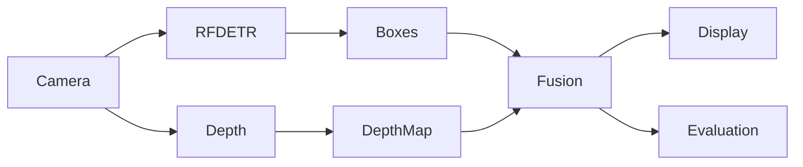
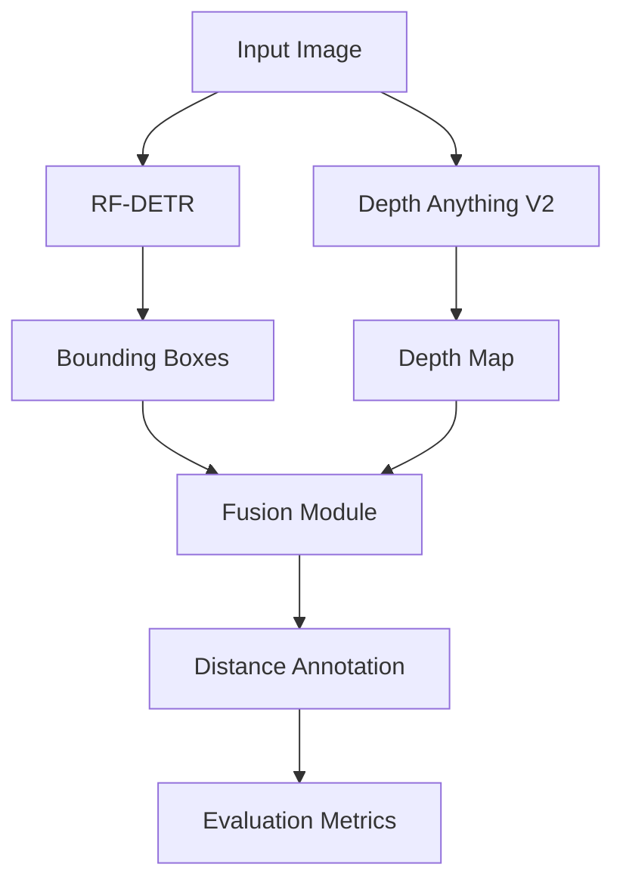
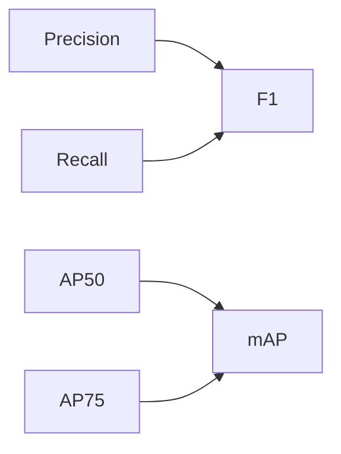
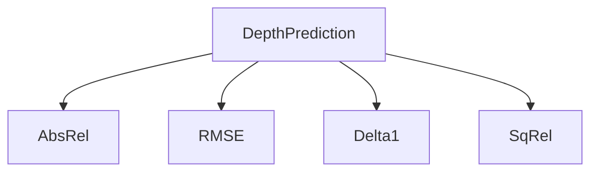
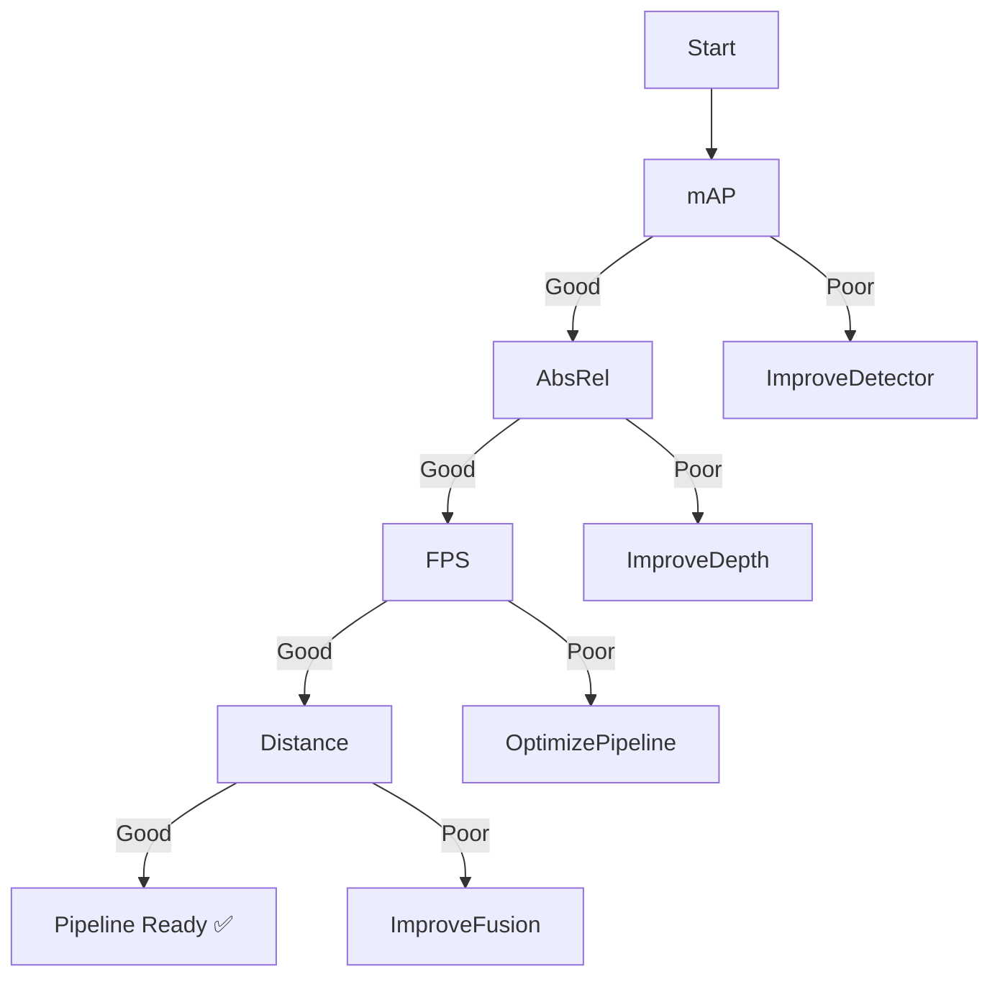
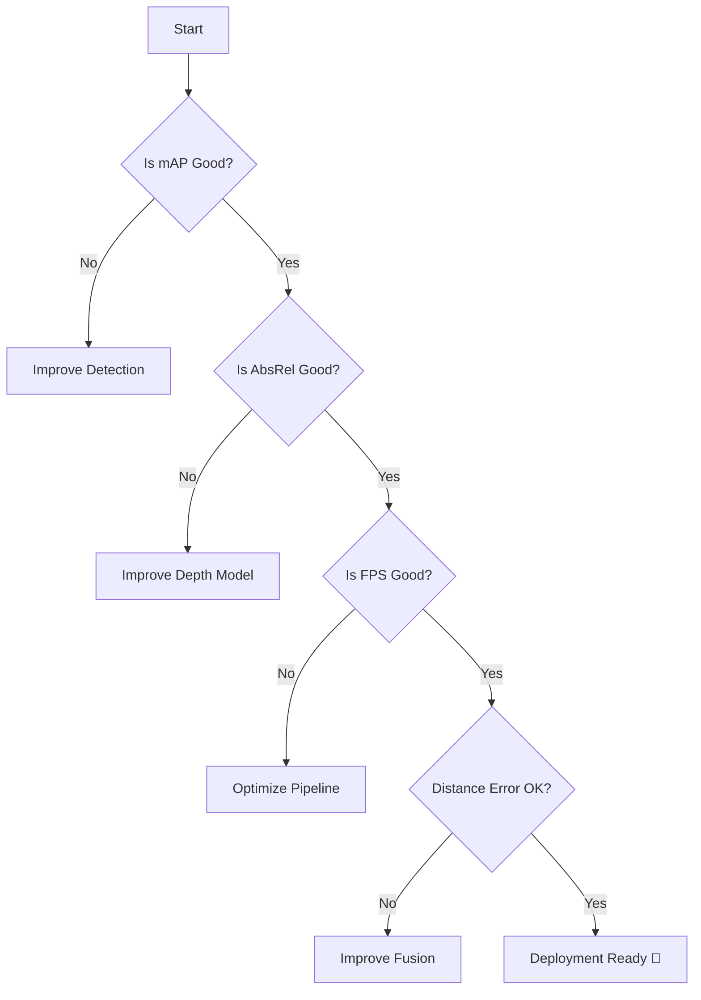

# 🚀 RF-DETR + Depth Anything V2 Evaluation Framework

> A comprehensive evaluation framework for benchmarking real-time object detection, monocular depth estimation, and end-to-end perception performance for autonomous robotics and FPV drone applications.


---

# 📚 Table of Contents

- Overview
- System Architecture
- Pipeline Workflow
- Repository Structure
- Evaluation Overview
- Detection Metrics
- Depth Metrics
- End-to-End Metrics
- Performance Targets
- Evaluation Workflow
- Troubleshooting
- FAQs
- References

---

# 🎯 Overview

## What is this project?

Modern autonomous systems rely on multiple AI models working together rather than a single model. In this project, **RF-DETR** performs real-time object detection while **Depth Anything V2** estimates the distance of every pixel in the scene. The outputs from both models are fused to determine **what objects are present and how far away they are**, enabling spatial understanding from a single RGB camera.

Rather than developing a new detection or depth estimation model, this repository focuses on **systematic evaluation and benchmarking** of the complete perception pipeline. It provides a standardized framework for measuring detection accuracy, depth estimation quality, computational efficiency, and end-to-end system performance under realistic operating conditions.

The framework is designed for researchers, students, and robotics engineers who want to understand **how reliable a perception pipeline is before deploying it on real-world platforms** such as FPV drones, autonomous vehicles, mobile robots, and embedded AI systems.

---

## Components

| Component | Purpose |
|------------|----------|
| RF-DETR | Detect Objects |
| Depth Anything V2 | Estimate Depth |
| Fusion Module | Merge Detection + Depth |
| Evaluator | Calculate Metrics |

---

# 🏗️ System Architecture



---

# ⚙️ Pipeline Workflow



---

# 📂 Repository Structure

```text
project/
│
├── datasets/
│
├── models/
│
├── src/
│   ├── detection/
│   ├── depth/
│   ├── fusion/
│   └── evaluation/
│
├── notebooks/
│
├── outputs/
│
├── README.md
│
└── requirements.txt
```

---

# 📊 Evaluation Overview

## Four Metrics You Should Always Check

| Metric | What it Measures | Good Value | Better |
|----------|-----------------|------------|---------|
| mAP | Detection Accuracy | 0.35-0.55 | ↑ |
| AbsRel | Depth Accuracy | <0.10 | ↓ |
| FPS | Pipeline Speed | >24 FPS | ↑ |
| Distance Error | Object Distance Accuracy | <10% | ↓ |

---

# 🧠 Which Metric Answers Which Question?

| Question | Metric |
|------------|----------|
| Did the detector find the object? | mAP |
| Did it miss objects? | Recall |
| Did it create false detections? | Precision |
| Are bounding boxes accurate? | AP50 / AP75 |
| Is depth estimation correct? | AbsRel |
| Is the system fast enough? | FPS |
| Can I trust displayed distance? | Per Object Distance Error |

---

# 📦 Detection Metrics

## Overview

| Metric | Description | Goal |
|----------|-------------|------|
| mAP | Overall Detection | High |
| AP50 | Loose Bounding Boxes | High |
| AP75 | Tight Bounding Boxes | High |
| Precision | False Positive Control | High |
| Recall | Missed Object Control | High |
| F1 Score | Balanced Performance | High |

---

## Easy Explanation

| Metric | Think of it Like... |
|----------|---------------------|
| mAP | Did I draw the correct box? |
| Precision | Did I detect something that wasn't there? |
| Recall | Did I miss someone? |
| AP50 | Roughly correct box |
| AP75 | Nearly perfect box |

---

## Detection Relationship



---

# 🌄 Depth Metrics

## Overview

| Metric | Description | Goal |
|----------|-------------|------|
| AbsRel | Relative Error | Low |
| RMSE | Average Error | Low |
| δ1 | Pixels within 25% Error | High |
| SqRel | Penalizes Large Errors | Low |

---

## Easy Explanation

| Metric | Think of it Like... |
|----------|---------------------|
| AbsRel | Average percentage mistake |
| RMSE | Average meters off |
| δ1 | How many pixels are correct |
| SqRel | Punishes huge mistakes |

---

## Depth Metric Relationship



---

# 🚀 End-to-End Metrics

| Metric | Description |
|----------|-------------|
| FPS | Frames per Second |
| Latency | Time per Frame |
| CPU Usage | Processor Usage |
| GPU Usage | GPU Utilization |
| Memory | RAM Usage |

---

# 📈 Performance Targets

| Metric | Excellent 🟢 | Good 🟡 | Poor 🔴 |
|----------|--------------|----------|----------|
| mAP | >0.55 | 0.35-0.55 | <0.30 |
| AbsRel | <0.08 | 0.08-0.12 | >0.15 |
| FPS | >30 | 15-30 | <10 |
| Distance Error | <8% | 8-12% | >15% |

---

# 🔄 Evaluation Workflow



---

# 🩺 Troubleshooting Guide

| Problem | Check | Meaning |
|----------|-------|----------|
| Low mAP | AP50 | Model misses objects |
| Low AP75 | Bounding boxes inaccurate |
| Low Precision | Too many false detections |
| Low Recall | Missing real objects |
| High AbsRel | Depth estimation inaccurate |
| High RMSE | Large depth errors |
| Low FPS | Hardware bottleneck |
| High Latency | Slow inference |

---

# 📌 Decision Tree



---

# 💡 Best Practices

| ✅ Do | ❌ Don't |
|--------|----------|
| Evaluate on unseen data | Test only on training data |
| Measure end-to-end FPS | Quote model-only FPS |
| Report hardware specs | Ignore benchmarking setup |
| Use multiple metrics | Depend on one score |

---

# ❓ Frequently Asked Questions

## Why not use Accuracy?

Object detection requires both classification and localization.

---

## Why use mAP?

It measures detection quality more comprehensively than simple accuracy.

---

## Why use AbsRel?

It fairly evaluates depth error across both near and far objects.

---

## Why measure End-to-End FPS?

Individual model FPS does not represent complete pipeline performance.

---

# 📚 References

| Paper | Link |
|---------|------|
| RF-DETR | |
| Depth Anything V2 | |
| COCO Evaluation | |
| KITTI | |
| NYU Depth V2 | |

---

# 🎯 Quick Summary

| Remember These Four | Why |
|----------------------|-----|
| mAP | Detection Quality |
| AbsRel | Depth Accuracy |
| FPS | Pipeline Speed |
| Per-Object Distance Error | Final Output Accuracy |

---

## ⭐ Key Takeaway

```text
Detection Quality  → mAP
Depth Quality      → AbsRel
Pipeline Speed     → FPS
Final Output Trust → Distance Error
```
